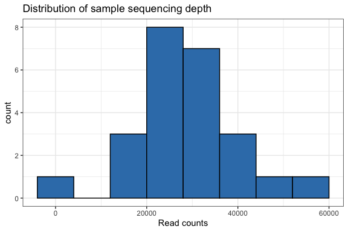
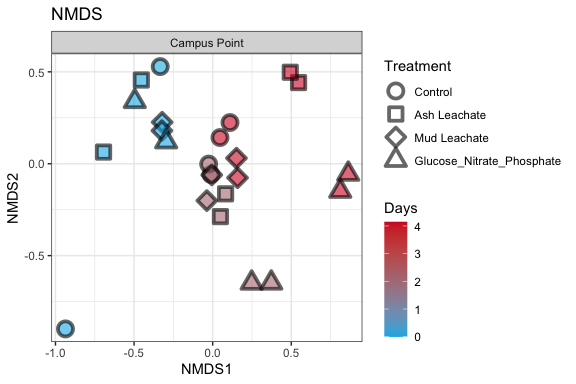
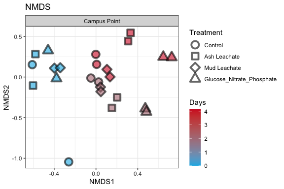
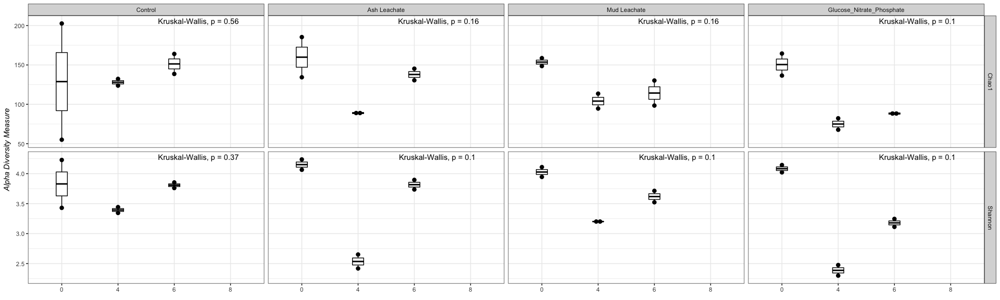
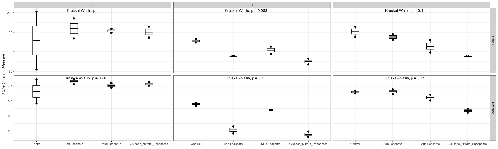
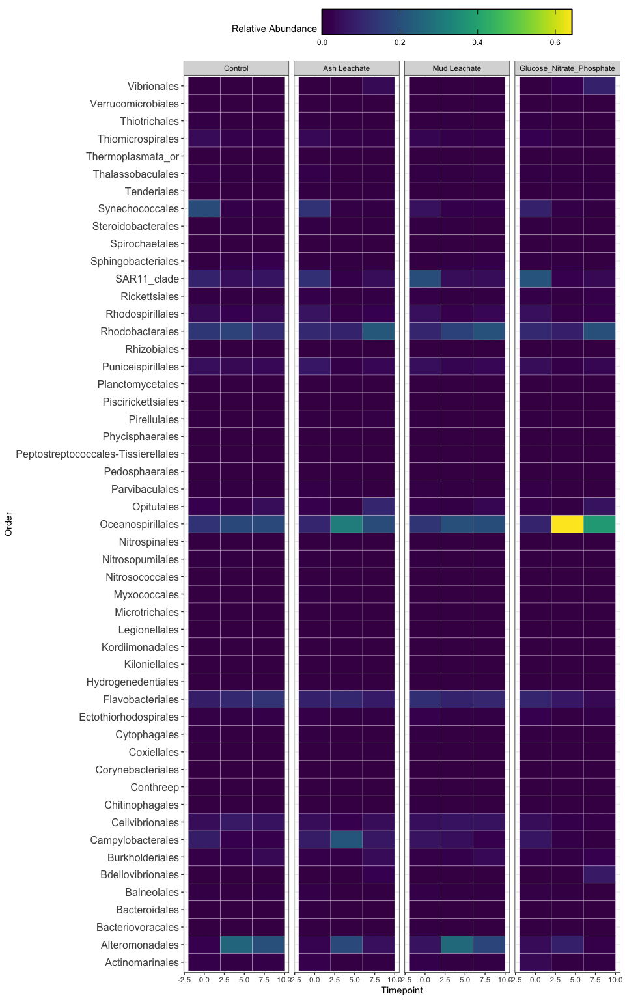

ASV\_Analysis
================
Ysabelle Chavez
11/15/2020

# Intro

We explore the processed ACIDD 16S sequences using
[phyloseq](https://joey711.github.io/phyloseq/)

# Install phyloseq

``` r
# BiocManager::install("phyloseq")
```

``` r
library(tidyverse) 
library(phyloseq)
library(RColorBrewer)
library(readxl)
```

# Import Data

``` r
count.tab <- read_rds("~/Desktop/GitHub/144l_students/Input_Data/week6/seqtab-nochimtaxa.rds") #table of counts for each sequence in each sample
tax.tab <- read_rds("~/Desktop/GitHub/144l_students/Input_Data/week6/taxa.rds") #table that matches ASV to sequence

samples <- read_excel("~/Desktop/GitHub/144l_students/Input_Data/week3/144L_2018_BactAbund.xlsx", sheet = "Metadata") %>%
  select(Treatment, Bottle, Timepoint, DNA_SampleID)

sample.tab <- read_rds("~/Desktop/GitHub/144l_students/Output_Data/week4/W4_TOC_DOC.rds") %>% 
  left_join(., samples) %>%
  drop_na(DNA_SampleID) %>% 
  column_to_rownames(var = "DNA_SampleID") 

glimpse(sample.tab)
```

    ## Rows: 24
    ## Columns: 58
    ## $ Experiment           <chr> "144L_2018", "144L_2018", "144L_2018", "144L_201…
    ## $ Location             <chr> "Campus Point", "Campus Point", "Campus Point", …
    ## $ Temperature          <dbl> 20, 20, 20, 20, 20, 20, 20, 20, 20, 20, 20, 20, …
    ## $ Depth                <dbl> 1, 1, 1, 1, 1, 1, 1, 1, 1, 1, 1, 1, 1, 1, 1, 1, …
    ## $ Bottle               <chr> "A", "A", "A", "B", "B", "B", "C", "C", "C", "D"…
    ## $ Timepoint            <dbl> 0, 4, 8, 0, 4, 8, 0, 4, 8, 0, 4, 8, 0, 4, 8, 0, …
    ## $ Treatment            <chr> "Control", "Control", "Control", "Control", "Con…
    ## $ Target_DOC_Amendment <dbl> 0, 0, 0, 0, 0, 0, 10, 10, 10, 10, 10, 10, 10, 10…
    ## $ Inoculum_L           <dbl> 1.5, 1.5, 1.5, 1.5, 1.5, 1.5, 1.5, 1.5, 1.5, 1.5…
    ## $ Media_L              <dbl> 3.5, 3.5, 3.5, 3.5, 3.5, 3.5, 3.5, 3.5, 3.5, 3.5…
    ## $ Datetime             <dttm> 2018-10-15 16:30:00, 2018-10-17 20:00:00, 2018-…
    ## $ hours                <dbl> 0.0, 51.5, 99.5, 0.0, 51.5, 99.5, 0.0, 51.5, 99.…
    ## $ days                 <dbl> 0.000000, 2.145833, 4.145833, 0.000000, 2.145833…
    ## $ TOC                  <dbl> 81.30000, 81.77997, 78.87473, 80.80000, 80.25890…
    ## $ sd_TOC               <dbl> 0.40000000, NA, 0.38725049, 0.20000000, 0.030696…
    ## $ PTOC                 <dbl> 81.3, 79.5, 78.3, 80.8, 80.8, 79.3, 91.1, 86.6, …
    ## $ sd_PTOC              <dbl> 0.4, 0.6, 0.2, 0.2, 1.0, 0.7, NA, 0.4, 0.6, 0.4,…
    ## $ cells                <dbl> 332531522, 933025234, 967204148, 389243418, 1106…
    ## $ ln_cells             <dbl> 19.62225, 20.65394, 20.68992, 19.77972, 20.82448…
    ## $ diff_ln_cells        <dbl> 0.00000000, 0.02829106, 0.16697475, 0.00000000, …
    ## $ bc                   <dbl> 0.8313288, 2.3325631, 2.4180104, 0.9731085, 2.76…
    ## $ ave_bc               <dbl> 0.9022187, 2.5494210, 2.2426862, 0.9022187, 2.54…
    ## $ exp_start            <dbl> 0, 0, 0, 0, 0, 0, 0, 0, 0, 0, 0, 0, 0, 0, 0, 0, …
    ## $ exp_end              <dbl> 1, 1, 1, 1, 1, 1, 1, 1, 1, 1, 1, 1, 1, 1, 1, 1, …
    ## $ ln_cells_exp_start   <dbl> 19.62225, 19.62225, 19.62225, 19.77972, 19.77972…
    ## $ ln_cells_exp_end     <dbl> 20.07689, 20.07689, 20.07689, 20.10741, 20.10741…
    ## $ cells_exp_start      <dbl> 332531522, 332531522, 332531522, 389243418, 3892…
    ## $ cells_exp_end        <dbl> 523943125, 523943125, 523943125, 540180187, 5401…
    ## $ days_exp_start       <dbl> 0, 0, 0, 0, 0, 0, 0, 0, 0, 0, 0, 0, 0, 0, 0, 0, …
    ## $ days_exp_end         <dbl> 0.6458333, 0.6458333, 0.6458333, 0.6458333, 0.64…
    ## $ mew                  <dbl> 0.7039718, 0.7039718, 0.7039718, 0.5074031, 0.50…
    ## $ doubling             <dbl> 0.9846235, 0.9846235, 0.9846235, 1.3660680, 1.36…
    ## $ delta_cells          <dbl> 523943125, 523943125, 523943125, 540180187, 5401…
    ## $ `first(cells)`       <dbl> 332531522, 332531522, 332531522, 389243418, 3892…
    ## $ delta_bc             <dbl> 1.309858, 1.309858, 1.309858, 1.350450, 1.350450…
    ## $ ave_mew              <dbl> 0.6056875, 0.6056875, 0.6056875, 0.6056875, 0.60…
    ## $ ave_doubling         <dbl> 1.1753457, 1.1753457, 1.1753457, 1.1753457, 1.17…
    ## $ ave_delta_cells      <dbl> 532061656, 532061656, 532061656, 532061656, 5320…
    ## $ ave_delta_bc         <dbl> 1.330154, 1.330154, 1.330154, 1.330154, 1.330154…
    ## $ ave_lag              <dbl> 0, 0, 0, 0, 0, 0, 0, 0, 0, 0, 0, 0, 0, 0, 0, 0, …
    ## $ interp_toc           <dbl> 81.3, 79.5, 78.3, 80.8, 80.8, 79.3, 91.1, 86.6, …
    ## $ interp_bc            <dbl> 0.8, 2.3, 2.4, 1.0, 2.8, 2.1, 0.8, 3.4, 0.7, 0.9…
    ## $ doc                  <dbl> 80.5, 77.2, 75.9, 79.8, 78.0, 77.2, 90.3, 83.2, …
    ## $ bioav_doc            <dbl> 0.05714286, 0.05714286, 0.05714286, 0.03258145, …
    ## $ doc_exp_end          <dbl> 79.5, 79.5, 79.5, 79.4, 79.4, 79.4, 87.2, 87.2, …
    ## $ delta_doc            <dbl> 1.0, 1.0, 1.0, 0.4, 0.4, 0.4, 3.1, 3.1, 3.1, 3.7…
    ## $ tdelta_doc           <dbl> 4.6, 4.6, 4.6, 2.6, 2.6, 2.6, 8.3, 8.3, 8.3, 7.8…
    ## $ bge                  <dbl> NA, NA, NA, NA, NA, NA, 0.8035135, 0.8035135, 0.…
    ## $ ave_toc              <dbl> 81.05, 80.15, 78.80, 81.05, 80.15, 78.80, 91.25,…
    ## $ sd_toc               <dbl> 0.35355339, 0.91923882, 0.70710678, 0.35355339, …
    ## $ ave_bioav_doc        <dbl> 0.04486216, 0.04486216, 0.04486216, 0.04486216, …
    ## $ sd_bioav_doc         <dbl> 0.012599734, 0.012599734, 0.012599734, 0.0125997…
    ## $ ave_delta_doc        <dbl> 0.70, 0.70, 0.70, 0.70, 0.70, 0.70, 3.40, 3.40, …
    ## $ sd_delta_doc         <dbl> 0.3077935, 0.3077935, 0.3077935, 0.3077935, 0.30…
    ## $ ave_tdelta_doc       <dbl> 3.60, 3.60, 3.60, 3.60, 3.60, 3.60, 8.05, 8.05, …
    ## $ sd_tdelta_doc        <dbl> 1.02597835, 1.02597835, 1.02597835, 1.02597835, …
    ## $ ave_bge              <dbl> NA, NA, NA, NA, NA, NA, 0.788192, 0.788192, 0.78…
    ## $ sd_bge               <dbl> NA, NA, NA, NA, NA, NA, 0.01571952, 0.01571952, …

# Phyloseq Object

We need to create a phyloseq object that merges all three datasets.
Sometimes this doesn’t work beacuse of the format of the data files.
Make sure all the sample names between the sampleinfo.txt and
seqtab-nochimtaxa.txt are the same

``` r
OTU = otu_table(count.tab, taxa_are_rows = TRUE) 
TAX = tax_table(tax.tab)
SAM = sample_data(sample.tab)
ps = phyloseq(OTU,TAX,SAM) 
```

# Filter sequences

We will filter out chloroplasts and mitochondria, because we only
intended to amplify bacterial sequences. It’s good to check you don’t
have anything lurking in the taxonomy table.

``` r
sub_ps <- ps %>%
  # subset_samples(Experiment == "ASH172") %>%  #use this function if you want to only include some subset of your sample set in the subsequent analysis
  subset_taxa(Family  != "mitochondria" & Order  != "Chloroplast")
```

# Sample Summary

As a first analysis, we will look at the distribution of read counts
from our samples



``` r
# mean, max and min of sample read counts
summary(sample_sum_df)
```

    ##       sum       
    ##  Min.   : 2064  
    ##  1st Qu.:23420  
    ##  Median :28834  
    ##  Mean   :28810  
    ##  3rd Qu.:33572  
    ##  Max.   :53948

# Beta Diversity

Beta diversity involves calculating metrics such as distances or
dissimilarities based on pairwise comparisons of samples – they don’t
exist for a single sample, but rather only as metrics that relate
samples to each other. i.e. beta diversity = patterns in community
structure between samples

Since differences in sampling depths between samples can influence
distance/dissimilarity metrics, we first need to somehow normalize the
read depth across our samples.

## Subsample

We will rarefy (random subsample with replacement) the read depth of the
samples first (scale to the smallest library size).

[Case for not
subsampling](https://journals.plos.org/ploscompbiol/article?id=10.1371/journal.pcbi.1003531)

[Response blog for
subsampling](https://www.polarmicrobes.org/how-i-learned-to-stop-worrying-and-love-subsampling-rarifying/)

Read depth is an artifact of a machine made by a company in San Diego,
not anything about your samples or their biology. It is totally
artifactual, and controlling for artifacts is critical in science.
Subsampling randomly is the simplest way to control for this, and the
question is whether this is the “best” way of controlling for it. See
links above for alternative arguments about what the best way of
controlling for this artifact is.

A strong reason to subsample is to standardize effort. The bottom line
is that in all experimental design you should not be comparing things to
which you devote different effort in resolution. For instance, you don’t
sample one site once a week and another once a month if you want to
compare the dynamics between the sites. You standardize effort.

With that said, the bigger your differential in mean (or median) read
depth (reads/sample) between pre- and post-subsampling, the greater the
“effect” on beta diversity.

Examples:

  - means reads before = 40k, mean reads after = 1k, big effect.
  - mean reads before = 40k, mean reads after = 20k, small effect.
  - mean reads before = 2k, mean reads after = 1k, small effect.

We will subsample to the minimum read depth of all samples and not
subsample. We’ll then compare the mean reads pre- and post-subsampling
and also compare beta diversity patterns

``` r
ps_min <-  rarefy_even_depth(sub_ps, sample.size = min(sample_sums(sub_ps)))
```

    ## You set `rngseed` to FALSE. Make sure you've set & recorded
    ##  the random seed of your session for reproducibility.
    ## See `?set.seed`

    ## ...

    ## 144OTUs were removed because they are no longer 
    ## present in any sample after random subsampling

    ## ...

``` r
mean(sample_sums(sub_ps)) #28810
```

    ## [1] 28809.5

``` r
mean(sample_sums(ps_min)) #2064 this is also the same as min(sample_sums(sub)ps) 
```

    ## [1] 2064

Based on the mean reads pre- and post-subsampling, subsampling here
shouldn’t have a major effect on our beta diversity patterns

## NMDS

One of the best exploratory analyses for amplicon data is unconstrained
ordinations. Here we will look at non-metric multidimensional scaling
(NMDS) ordinations of our full community samples. For NMDS plots it’s
important to set a seed since the starting positions of samples in the
alogrithm is random.

``` r
set.seed(1)
# Ordinate
nmds <- ordinate(sub_ps, method = "NMDS",  distance = "bray") # stress = 0.04
```

    ## Square root transformation
    ## Wisconsin double standardization
    ## Run 0 stress 0.07297425 
    ## Run 1 stress 0.1456704 
    ## Run 2 stress 0.1543136 
    ## Run 3 stress 0.07297437 
    ## ... Procrustes: rmse 0.0001220482  max resid 0.0004435483 
    ## ... Similar to previous best
    ## Run 4 stress 0.08175278 
    ## Run 5 stress 0.07461253 
    ## Run 6 stress 0.07585647 
    ## Run 7 stress 0.1625183 
    ## Run 8 stress 0.0758564 
    ## Run 9 stress 0.1637431 
    ## Run 10 stress 0.07461228 
    ## Run 11 stress 0.1182041 
    ## Run 12 stress 0.07297426 
    ## ... Procrustes: rmse 2.255071e-05  max resid 4.643785e-05 
    ## ... Similar to previous best
    ## Run 13 stress 0.1678821 
    ## Run 14 stress 0.08344392 
    ## Run 15 stress 0.0758564 
    ## Run 16 stress 0.07626359 
    ## Run 17 stress 0.08175278 
    ## Run 18 stress 0.07297424 
    ## ... New best solution
    ## ... Procrustes: rmse 2.991335e-05  max resid 0.0001038873 
    ## ... Similar to previous best
    ## Run 19 stress 0.08172315 
    ## Run 20 stress 0.07504547 
    ## *** Solution reached

``` r
set.seed(1)
# Ordinate
nmds_min <- ordinate(ps_min, method = "NMDS",  distance = "bray") # stress = 0.04
```

    ## Square root transformation
    ## Wisconsin double standardization
    ## Run 0 stress 0.08240156 
    ## Run 1 stress 0.1475284 
    ## Run 2 stress 0.08377826 
    ## Run 3 stress 0.08377827 
    ## Run 4 stress 0.09150259 
    ## Run 5 stress 0.1592616 
    ## Run 6 stress 0.08240156 
    ## ... New best solution
    ## ... Procrustes: rmse 4.800569e-06  max resid 1.38976e-05 
    ## ... Similar to previous best
    ## Run 7 stress 0.1766052 
    ## Run 8 stress 0.08240157 
    ## ... Procrustes: rmse 2.845494e-06  max resid 6.425385e-06 
    ## ... Similar to previous best
    ## Run 9 stress 0.1773734 
    ## Run 10 stress 0.1687376 
    ## Run 11 stress 0.1430244 
    ## Run 12 stress 0.08377829 
    ## Run 13 stress 0.1475279 
    ## Run 14 stress 0.09151593 
    ## Run 15 stress 0.08240156 
    ## ... Procrustes: rmse 7.681039e-06  max resid 2.895376e-05 
    ## ... Similar to previous best
    ## Run 16 stress 0.08240157 
    ## ... Procrustes: rmse 1.469961e-05  max resid 5.676889e-05 
    ## ... Similar to previous best
    ## Run 17 stress 0.09134592 
    ## Run 18 stress 0.08240156 
    ## ... Procrustes: rmse 4.858878e-06  max resid 1.923528e-05 
    ## ... Similar to previous best
    ## Run 19 stress 0.09137767 
    ## Run 20 stress 0.2560533 
    ## *** Solution reached





NMDS plots attempt to show ordinal distances between samples as
accurately as possible in two dimensions. It is important to report the
stress of these plots, because a high stress value means that the
algorithm had a hard time representing the distances between samples in
2 dimensions. The stress of this plot was good - it was .04 (generally
anything below .2 is considered acceptable).

Subsampling doesn’t appear to affect the patterns we see in beta
diversity, so moving forward, we will focus on the subsampled dataset.

# Alpha Diversity

Estimating alpha diversity of microbial communities is
[problematic](https://www.ncbi.nlm.nih.gov/pmc/articles/PMC93182/) no
matter what you do.

We are going to calculate the Chao1 index for richness and the Shannon
diversity index.

**it is important to note that the alpha diversity values are not
interpretable as “real” numbers of anything (due to the nature of
amplicon data), but they can still be useful as relative metrics of
comparison. If Chao1 richness goes up, but Shannon diversity goes down,
it indicates that the sample may have more ASVs but is dominated by a
few of them.**

We will use the subsampled library, which retains estimates of the
species abundance of the real population while standardizing sampling
effort.

[subsampling and alpha diversity
paper](https://www.frontiersin.org/articles/10.3389/fmicb.2019.02407/full)

[Chao1: nonparametric estimation of minimum community
richness](https://www.jstor.org/stable/4615964?seq=1#metadata_info_tab_contents)

``` r
richness <- estimate_richness(ps_min, measures = c("Chao1", "Shannon")) %>% 
  rownames_to_column(., var = "DNA_ID") %>% 
  mutate_at(vars(DNA_ID), str_replace_all, pattern = "X144_", "144_")
```

Let’s add the sample metadata into this dataframe

``` r
alphadiv <- left_join(richness, sample.tab %>% rownames_to_column(., var = "DNA_ID")) 
```

    ## Joining, by = "DNA_ID"



Boxes represent the 1.5 interquartile range, with the internal solid
line representing the median. Circles represent data points. p-values
are reported the non-parametric two sample Wilcoxon test, which tests
whether the means between two groups are equal (ns: p \> 0.05, \* : p≤
0.05, \*\* : p ≤ 0.01).

Difference in the alpha diversity indexes among conditions were tested
using pairwise Wilcoxon tests; p \< 0.05 was considered the threshold
significance for a difference between conditions.

From this plot we can see within the treatments that the richness (via
Chao index) of our samples significantly changed, while overall
diversity (via Shannon index) did not change. This suggest that while
richness decreased in both the control and ash leachate treatments, the
eveness was similar between the initial and final conditions.



From this plot we can see between the treatments that the richness of
the control samples were higher at the initial condition than the ash
leachate, suggesting that there may have been some quality control
issues as we would expect the initial samples to all have the same
richness. By timepoint 6, it looks like the richness was about the same
between the control and the ash leachate. Overall diversity was similar
between the treatments at the initial condition, but not by the end of
the experiment. The ash leachate samples at timepoint 6 may have been
less even.

**In sum, we observe that richness similarly decreased within the
treatments over time, but overall diversity was lower in the ash
leachate experiments, suggesting that those communities became less rich
and less even relative to the control. i.e. relative to the control, ash
leachate samples had less ASVs and were dominated by fewer of them.**

# Who??

Which taxa were important? Which taxa were contributing to the change in
community compositon?

**Note: Recovered 16S rRNA gene copy numbers do not equal organism
abundance.**

That said, we can generate a heat map of our samples showing us how the
relative abundance of different taxonomic groups change…potentially
giving us a visual of which taxa are most important to the alpha and
beta diversity patterns we observed. First, we’re going to generate a
custom table that will be easier to work with than a phyloseq object.

## Generate relative abundances

Our data currently shows number gene copies recovered, so we’ll convert
to percentages (relative abundances)

``` r
ps_std <- transform_sample_counts(ps_min, function(x) x/sum(x))
#extract the relative abundance table and coerce into dataframe
ps_std.tab <- as(otu_table(ps_std), "matrix")
ps_std.df = as.data.frame(ps_std.tab) 
```

## Make table

``` r
#first coerce the taxa table into a data frame
tax.df <-  as.data.frame(tax.tab) 
#then combine the data frames
custom.tab <- tax.df %>% 
  rownames_to_column(., var = "asv") %>% 
  left_join(., ps_std.df %>% rownames_to_column(., var = "asv")) %>% 
  #create a new index of that combines the  class, order, family, and genus values, you can play around here!!
  mutate(#pcofg = paste(Phylum, "_", Class, "_", Order,"_", Family, "_", Genus),
         # pcof = paste(Phylum, "_", Class, "_", Order,"_", Family,),
         pco = paste(Phylum, "_", Class, "_", Order)) %>% 
  select(-c(asv:Genus)) %>% 
  # select(pcof,everything()) %>% 
  # group_by(pcof) %>% 
  select(pco,everything()) %>% 
  group_by(pco) %>% 
  #here we are combining the relative abundances based on our grouping
  summarise_at(vars(1:24), sum, na.rm = T) %>% 
  ungroup()
```

    ## Joining, by = "asv"

``` r
#save the row names and then make them into the column names
colnames <- custom.tab[,1] 

#transpose the dataframe so we can merge with the sample info table
t_custom.tab <-  as.data.frame(t(custom.tab[,-1]))
# colnames(t_custom.tab) <- colnames$pcof
colnames(t_custom.tab) <- colnames$pco

#merge
sweet.tab <- t_custom.tab %>% 
  rownames_to_column(., var = "sample") %>% 
  left_join(., sample.tab %>% rownames_to_column(., var = "sample") %>% select(sample, Experiment, Location, Bottle, Treatment, Timepoint, days, cells)) %>% 
  select(sample, Experiment:cells, everything())
```

    ## Joining, by = "sample"

``` r
relabund <- sweet.tab %>% 
  select(-c(sample:cells)) %>% 
  #remove groups that are completely absent
  .[ , colSums(.) > 0] %>% 
  #arrange by biggest contributors
  .[, order(colSums(-.))] %>% 
  bind_cols(sweet.tab %>% select(sample:cells), .)
```

## Heatmap



From this kind of plot, you can get an idea of who responded to the ash
leachate…that is, who uniquely increased in relative abundance in the
ash leachate treatment that did not in the control? what about decrease?

It looks like ASVs belonging to Oceanospirialles, Campylobacterales, and
Alteromonadales all increased in relative abundance in the ash leachate
experiments, but did not in the control. It looks any decreases in ASVs
were similar between the treatments\! Pretty cool data\!\!

Everything shown here is just a snapshot of what you can look at with
your community composition data. There are many other resources you can
use to get ideas of how to look at different aspects of your data,
including the [phyloseq tutorial](https://joey711.github.io/phyloseq/)
and [happy belly bioinformatics](https://astrobiomike.github.io). It’s
up to you and your questions\!\!

# Save and knit

``` r
saveRDS(sweet.tab, "~/Desktop/GitHub/144l_students/Output_Data/week6/Custom_ASV_Table.rds")
saveRDS(sub_ps, "~/Desktop/GitHub/144l_students/Output_Data/week6/phyloseq_obj.rds")
saveRDS(ps_min, "~/Desktop/GitHub/144l_students/Output_Data/week6/subsampled_phyloseq_obj.rds")
saveRDS(alphadiv, "~/Desktop/GitHub/144l_students/Output_Data/week6/alphadiv.rds")
```
