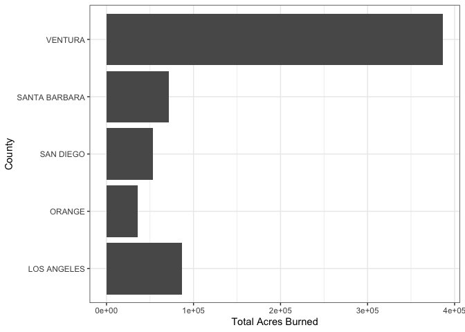
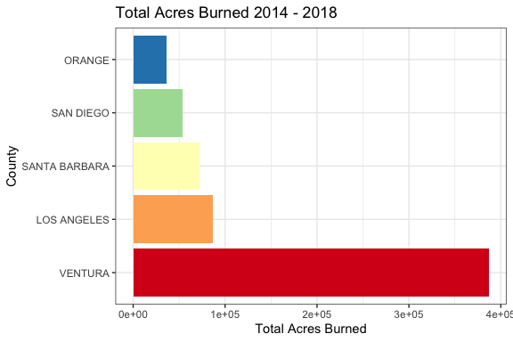

Intro2Rmarkdown
================
Nicholas Baetge
10/9/2020

# title

## title

### title

basic text.

*italicize* single asterisks

**bold** double asterisks

1.  make
2.  numbered
3.  lists

we can make:

  - unumbered
  - lists

[link here](https://www.google.com)

# Load Libraries

to add code, make a chunk by clicking (Insert \> R)

``` r
library(tidyverse)
library(readxl)
library(lubridate)
# install.packages("RColorBrewer")
library(RColorBrewer)
```

or by using shortcuts. on a mac: cmd + alt + i, on a pc: ctrl + alt +
i

# Load data

``` r
socal.fires <- readRDS("~/GITHUB/144l_students/Output_Data/week1/socal_fires_data.rds")
# socal.fires <- read_csv("~/GITHUB/144l_students/Output_Data/week1/socal_fires_data.csv")
```

# Look at data

``` r
glimpse(socal.fires)
```

    ## Rows: 43
    ## Columns: 12
    ## $ County_Unit          <chr> "VENTURA/SANTA BARBARA", "VENTURA", "LOS ANGELES…
    ## $ Fire_Name            <chr> "THOMAS", "WOOLSEY", "SAND", "REY", "HOLY", "BAS…
    ## $ Start_Date           <dttm> 2017-12-04, 2018-11-08, 2016-07-22, 2016-08-18,…
    ## $ Controlled_Date      <dttm> 2018-01-12, 2018-11-22, 2016-08-06, 2016-09-15,…
    ## $ Total_Acres_Burned   <dbl> 281893, 96949, 41383, 32606, 23025, 21240, 18430…
    ## $ Cause                <chr> "UNDETERMINED", "UNDETERMINED", "UNDETERMINED", …
    ## $ Structures_Destroyed <dbl> 16, 1643, 116, 5, 24, 0, 4, 123, 0, 25, 16, 5, 5…
    ## $ Structures_Damaged   <dbl> 274, 364, 2, 0, 18, 1, 7, 81, 0, 55, 3, 0, 0, 3,…
    ## $ struc_impact         <dbl> 290, 2007, 118, 5, 42, 1, 11, 204, 0, 80, 19, 5,…
    ## $ interv               <Interval> 2017-12-04 UTC--2018-01-12 UTC, 2018-11-08 …
    ## $ dur                  <Duration> 3369600s (~5.57 weeks), 1209600s (~2 weeks)…
    ## $ days                 <dbl> 39, 14, 15, 28, 39, 2, 89, 24, 7, 8, 12, 8, 7, 1…

# Make plot dataframe

``` r
plot.data <- socal.fires %>%
  rename(county = County_Unit,
         fire = Fire_Name,
         start = Start_Date,
         end = Controlled_Date,
         acres = Total_Acres_Burned,
         cause = Cause) %>%
  mutate(county = ifelse(fire == "THOMAS", "VENTURA", county),
         year = year(start))
```

    ## Rows: 43
    ## Columns: 13
    ## $ county               <chr> "VENTURA", "VENTURA", "LOS ANGELES", "SANTA BARB…
    ## $ fire                 <chr> "THOMAS", "WOOLSEY", "SAND", "REY", "HOLY", "BAS…
    ## $ start                <dttm> 2017-12-04, 2018-11-08, 2016-07-22, 2016-08-18,…
    ## $ end                  <dttm> 2018-01-12, 2018-11-22, 2016-08-06, 2016-09-15,…
    ## $ acres                <dbl> 281893, 96949, 41383, 32606, 23025, 21240, 18430…
    ## $ cause                <chr> "UNDETERMINED", "UNDETERMINED", "UNDETERMINED", …
    ## $ Structures_Destroyed <dbl> 16, 1643, 116, 5, 24, 0, 4, 123, 0, 25, 16, 5, 5…
    ## $ Structures_Damaged   <dbl> 274, 364, 2, 0, 18, 1, 7, 81, 0, 55, 3, 0, 0, 3,…
    ## $ struc_impact         <dbl> 290, 2007, 118, 5, 42, 1, 11, 204, 0, 80, 19, 5,…
    ## $ interv               <Interval> 2017-12-04 UTC--2018-01-12 UTC, 2018-11-08 …
    ## $ dur                  <Duration> 3369600s (~5.57 weeks), 1209600s (~2 weeks)…
    ## $ days                 <dbl> 39, 14, 15, 28, 39, 2, 89, 24, 7, 8, 12, 8, 7, 1…
    ## $ year                 <dbl> 2017, 2018, 2016, 2016, 2018, 2014, 2017, 2017, …

# Summary Statistics and *group\_by()*

``` r
summary.data <- plot.data %>%
  group_by(county) %>% 
  summarize(total_acres = sum(acres)) %>%
  arrange(desc(total_acres)) %>% 
  ungroup()
```

``` r
county_year_summary.data <- plot.data %>% 
  group_by(county, year) %>% 
  summarize(total_acres = sum(acres)) %>% 
  arrange(desc(year), desc(total_acres)) %>% 
  ungroup() 
```

# Plot data

``` r
ggplot(summary.data, aes(x = county, y = total_acres)) +
  geom_col() +
  labs(x = "County", y = "Total Acres Burned") +
  theme_bw() +
  coord_flip()
```

<!-- -->

``` r
summary_factor <- summary.data %>% 
  mutate(county = factor(county, levels = county))
```

``` r
ggplot(summary_factor, aes(x = county, y = total_acres)) +
  geom_col(aes(fill = county)) +
  labs(x = "County", y = "Total Acres Burned", title = "Total Acres Burned 2014 - 2018") +
  scale_fill_brewer(palette = "Spectral") +
  theme_bw() +
  coord_flip() +
  guides(fill = F)
```

<!-- -->
