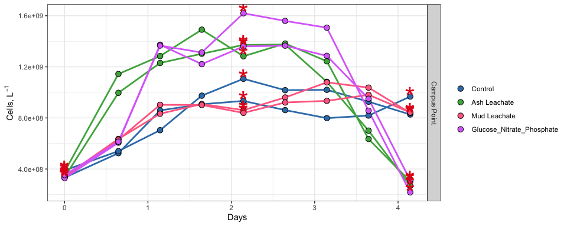
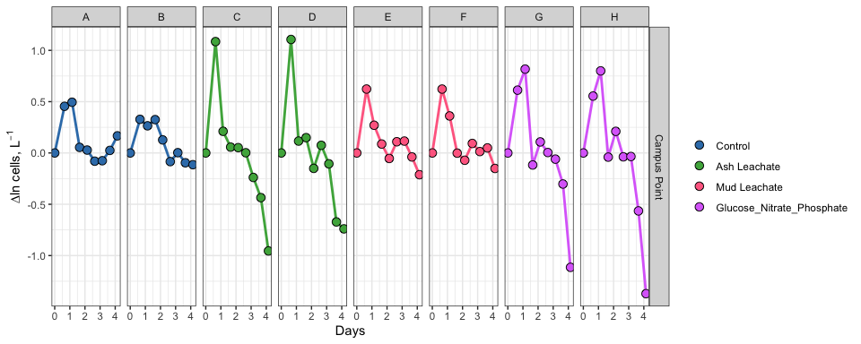
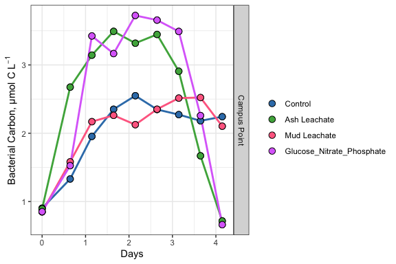
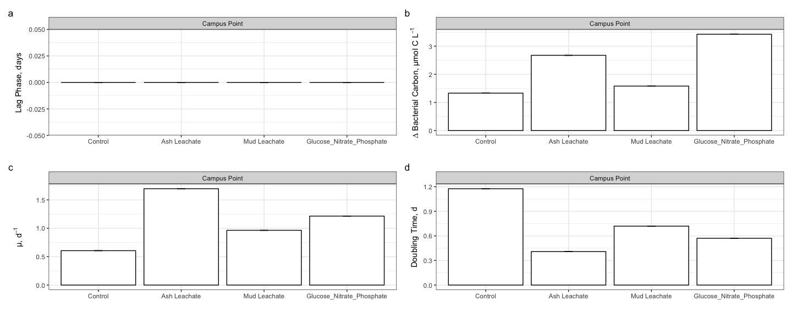

ACID Experiment Bacterial Abundance
================
Ysabelle Chavez
10/29/2020

# Intro

This document shows how **individual bottle** bacterial abundance data
from ACIDD experiments were processed, QC’d, and analyzed

``` r
library(tidyverse)
library(readxl)
library(lubridate)
```

# Import data

``` r
excel_sheets("~/144l_students/Input_Data/week3/144L_2018_BactAbund.xlsx")
```

    ## [1] "Metadata" "Data"

``` r
metadata <- read_excel("~/144l_students/Input_Data/week3/144L_2018_BactAbund.xlsx", sheet = "Metadata")
glimpse(metadata)
```

    ## Rows: 80
    ## Columns: 16
    ## $ Experiment           <chr> "144L_2018", "144L_2018", "144L_2018", "144L_201…
    ## $ Location             <chr> "Campus Point", "Campus Point", "Campus Point", …
    ## $ Temperature          <dbl> 20, 20, 20, 20, 20, 20, 20, 20, 20, 20, 20, 20, …
    ## $ Depth                <dbl> 1, 1, 1, 1, 1, 1, 1, 1, 1, 1, 1, 1, 1, 1, 1, 1, …
    ## $ Bottle               <chr> "A", "A", "A", "A", "A", "A", "A", "A", "A", "A"…
    ## $ Timepoint            <dbl> 0, 1, 2, 3, 4, 5, 6, 7, 8, 9, 0, 1, 2, 3, 4, 5, …
    ## $ Treatment            <chr> "Control", "Control", "Control", "Control", "Con…
    ## $ Target_DOC_Amendment <dbl> 0, 0, 0, 0, 0, 0, 0, 0, 0, 0, 0, 0, 0, 0, 0, 0, …
    ## $ Inoculum_L           <dbl> 1.5, 1.5, 1.5, 1.5, 1.5, 1.5, 1.5, 1.5, 1.5, 1.5…
    ## $ Media_L              <dbl> 3.5, 3.5, 3.5, 3.5, 3.5, 3.5, 3.5, 3.5, 3.5, 3.5…
    ## $ Datetime             <chr> "2018-10-15T16:30", "2018-10-16T08:00", "2018-10…
    ## $ TOC_Sample           <lgl> TRUE, FALSE, FALSE, FALSE, TRUE, FALSE, FALSE, F…
    ## $ Parallel_Sample      <lgl> TRUE, FALSE, FALSE, FALSE, TRUE, FALSE, FALSE, F…
    ## $ Cell_Sample          <lgl> TRUE, TRUE, TRUE, TRUE, TRUE, TRUE, TRUE, TRUE, …
    ## $ DNA_Sample           <lgl> TRUE, FALSE, FALSE, FALSE, TRUE, FALSE, FALSE, F…
    ## $ DNA_SampleID         <chr> "144_A0_S6", NA, NA, NA, "144_A4_S7", NA, NA, NA…

``` r
# unique(metadata$Experiment)
# unique(metadata$Location)
# unique(metadata$Bottle)
# unique(metadata$Treatment)

data <- read_excel("~/144l_students/Input_Data/week3/144L_2018_BactAbund.xlsx", sheet = "Data")
glimpse(data)
```

    ## Rows: 72
    ## Columns: 3
    ## $ Bottle    <chr> "A", "A", "A", "A", "A", "A", "A", "A", "A", "B", "B", "B",…
    ## $ Timepoint <dbl> 0, 1, 2, 3, 4, 5, 6, 7, 8, 0, 1, 2, 3, 4, 5, 6, 7, 8, 0, 1,…
    ## $ Cells_ml  <dbl> 332531.5, 523943.1, 859019.9, 906998.9, 933025.2, 861129.1,…

``` r
joined <- left_join(metadata, data)
```

    ## Joining, by = c("Bottle", "Timepoint")

``` r
names(joined)
```

    ##  [1] "Experiment"           "Location"             "Temperature"         
    ##  [4] "Depth"                "Bottle"               "Timepoint"           
    ##  [7] "Treatment"            "Target_DOC_Amendment" "Inoculum_L"          
    ## [10] "Media_L"              "Datetime"             "TOC_Sample"          
    ## [13] "Parallel_Sample"      "Cell_Sample"          "DNA_Sample"          
    ## [16] "DNA_SampleID"         "Cells_ml"

``` r
summary(joined)
```

    ##   Experiment          Location          Temperature     Depth  
    ##  Length:80          Length:80          Min.   :20   Min.   :1  
    ##  Class :character   Class :character   1st Qu.:20   1st Qu.:1  
    ##  Mode  :character   Mode  :character   Median :20   Median :1  
    ##                                        Mean   :20   Mean   :1  
    ##                                        3rd Qu.:20   3rd Qu.:1  
    ##                                        Max.   :20   Max.   :1  
    ##                                                                
    ##     Bottle            Timepoint    Treatment         Target_DOC_Amendment
    ##  Length:80          Min.   :0.0   Length:80          Min.   : 0.0        
    ##  Class :character   1st Qu.:2.0   Class :character   1st Qu.: 7.5        
    ##  Mode  :character   Median :4.5   Mode  :character   Median :10.0        
    ##                     Mean   :4.5                      Mean   : 7.5        
    ##                     3rd Qu.:7.0                      3rd Qu.:10.0        
    ##                     Max.   :9.0                      Max.   :10.0        
    ##                                                                          
    ##    Inoculum_L     Media_L      Datetime         TOC_Sample      Parallel_Sample
    ##  Min.   :1.5   Min.   :3.5   Length:80          Mode :logical   Mode :logical  
    ##  1st Qu.:1.5   1st Qu.:3.5   Class :character   FALSE:56        FALSE:48       
    ##  Median :1.5   Median :3.5   Mode  :character   TRUE :24        TRUE :32       
    ##  Mean   :1.5   Mean   :3.5                                                     
    ##  3rd Qu.:1.5   3rd Qu.:3.5                                                     
    ##  Max.   :1.5   Max.   :3.5                                                     
    ##                                                                                
    ##  Cell_Sample     DNA_Sample      DNA_SampleID          Cells_ml      
    ##  Mode :logical   Mode :logical   Length:80          Min.   : 217373  
    ##  FALSE:8         FALSE:56        Class :character   1st Qu.: 635494  
    ##  TRUE :72        TRUE :24        Mode  :character   Median : 914685  
    ##                                                     Mean   : 907035  
    ##                                                     3rd Qu.:1223420  
    ##                                                     Max.   :1619535  
    ##                                                     NA's   :8

``` r
glimpse(joined)
```

    ## Rows: 80
    ## Columns: 17
    ## $ Experiment           <chr> "144L_2018", "144L_2018", "144L_2018", "144L_201…
    ## $ Location             <chr> "Campus Point", "Campus Point", "Campus Point", …
    ## $ Temperature          <dbl> 20, 20, 20, 20, 20, 20, 20, 20, 20, 20, 20, 20, …
    ## $ Depth                <dbl> 1, 1, 1, 1, 1, 1, 1, 1, 1, 1, 1, 1, 1, 1, 1, 1, …
    ## $ Bottle               <chr> "A", "A", "A", "A", "A", "A", "A", "A", "A", "A"…
    ## $ Timepoint            <dbl> 0, 1, 2, 3, 4, 5, 6, 7, 8, 9, 0, 1, 2, 3, 4, 5, …
    ## $ Treatment            <chr> "Control", "Control", "Control", "Control", "Con…
    ## $ Target_DOC_Amendment <dbl> 0, 0, 0, 0, 0, 0, 0, 0, 0, 0, 0, 0, 0, 0, 0, 0, …
    ## $ Inoculum_L           <dbl> 1.5, 1.5, 1.5, 1.5, 1.5, 1.5, 1.5, 1.5, 1.5, 1.5…
    ## $ Media_L              <dbl> 3.5, 3.5, 3.5, 3.5, 3.5, 3.5, 3.5, 3.5, 3.5, 3.5…
    ## $ Datetime             <chr> "2018-10-15T16:30", "2018-10-16T08:00", "2018-10…
    ## $ TOC_Sample           <lgl> TRUE, FALSE, FALSE, FALSE, TRUE, FALSE, FALSE, F…
    ## $ Parallel_Sample      <lgl> TRUE, FALSE, FALSE, FALSE, TRUE, FALSE, FALSE, F…
    ## $ Cell_Sample          <lgl> TRUE, TRUE, TRUE, TRUE, TRUE, TRUE, TRUE, TRUE, …
    ## $ DNA_Sample           <lgl> TRUE, FALSE, FALSE, FALSE, TRUE, FALSE, FALSE, F…
    ## $ DNA_SampleID         <chr> "144_A0_S6", NA, NA, NA, "144_A4_S7", NA, NA, NA…
    ## $ Cells_ml             <dbl> 332531.5, 523943.1, 859019.9, 906998.9, 933025.2…

# Prepare data

Convert date and time column values from characters to dates, add
columns with time elapsed for each experiment, and convert cells/ml to
cells/l, subset data to select only VOI & drop na’s

``` r
cells <- joined %>%
  mutate(Datetime = ymd_hm(Datetime),
        cells = Cells_ml * 1000) %>%
  group_by(Experiment, Treatment, Bottle) %>%
  mutate(interv = interval(first(Datetime), Datetime),
         hours = interv/3600,
         days = hours/24) %>%
  ungroup() %>%
  select(Experiment:DNA_Sample, hours, days, cells) %>%
  drop_na(cells)

glimpse(cells)
```

    ## Rows: 72
    ## Columns: 18
    ## $ Experiment           <chr> "144L_2018", "144L_2018", "144L_2018", "144L_201…
    ## $ Location             <chr> "Campus Point", "Campus Point", "Campus Point", …
    ## $ Temperature          <dbl> 20, 20, 20, 20, 20, 20, 20, 20, 20, 20, 20, 20, …
    ## $ Depth                <dbl> 1, 1, 1, 1, 1, 1, 1, 1, 1, 1, 1, 1, 1, 1, 1, 1, …
    ## $ Bottle               <chr> "A", "A", "A", "A", "A", "A", "A", "A", "A", "B"…
    ## $ Timepoint            <dbl> 0, 1, 2, 3, 4, 5, 6, 7, 8, 0, 1, 2, 3, 4, 5, 6, …
    ## $ Treatment            <chr> "Control", "Control", "Control", "Control", "Con…
    ## $ Target_DOC_Amendment <dbl> 0, 0, 0, 0, 0, 0, 0, 0, 0, 0, 0, 0, 0, 0, 0, 0, …
    ## $ Inoculum_L           <dbl> 1.5, 1.5, 1.5, 1.5, 1.5, 1.5, 1.5, 1.5, 1.5, 1.5…
    ## $ Media_L              <dbl> 3.5, 3.5, 3.5, 3.5, 3.5, 3.5, 3.5, 3.5, 3.5, 3.5…
    ## $ Datetime             <dttm> 2018-10-15 16:30:00, 2018-10-16 08:00:00, 2018-…
    ## $ TOC_Sample           <lgl> TRUE, FALSE, FALSE, FALSE, TRUE, FALSE, FALSE, F…
    ## $ Parallel_Sample      <lgl> TRUE, FALSE, FALSE, FALSE, TRUE, FALSE, FALSE, F…
    ## $ Cell_Sample          <lgl> TRUE, TRUE, TRUE, TRUE, TRUE, TRUE, TRUE, TRUE, …
    ## $ DNA_Sample           <lgl> TRUE, FALSE, FALSE, FALSE, TRUE, FALSE, FALSE, F…
    ## $ hours                <Interval> 2018-10-15 16:30:00 UTC--2018-10-15 16:30:0…
    ## $ days                 <Interval> 2018-10-15 16:30:00 UTC--2018-10-15 16:30:0…
    ## $ cells                <dbl> 332531522, 523943125, 859019934, 906998856, 9330…

# Plot growth curves

``` r
custom.colors <- c("Control" = "#377EB8", "Ash Leachate" = "#4DAF4A", "Mud Leachate" = "#FF6C90", "Glucose_Nitrate_Phosphate" = "#DC71FA", "Campus Point" = "E41A1C")
levels <- c("Control", "Ash Leachate", "Mud Leachate", "Glucose_Nitrate_Phosphate", "Campus Point")

cells %>%
  mutate(dna = ifelse(DNA_Sample == T, "*", NA)) %>%
  ggplot(aes(x = days, y = cells, group = interaction(Experiment, Treatment, Bottle))) +
  geom_line(aes(color = factor(Treatment, levels = levels)), size = 1) +
  geom_point(aes(fill = factor(Treatment, levels = levels)), size = 3, color = "black", shape = 21) +
  geom_text(aes(label = dna), size = 12, color = "#E41A1C") +
    labs(x = "Days", y = expression(paste("Cells, L"^-1)), fill = "") +
    guides(color = F) +
  scale_color_manual(values = custom.colors) +
  scale_fill_manual (values = custom.colors) +
  facet_grid(rows = "Location", scales = "free") +
  theme_bw()
```

    ## Warning: Removed 48 rows containing missing values (geom_text).

<!-- -->

We can calculate:

  - The total change in cells from the initial condition to the end of
    the experiment
  - Specific growth rates as the slope of ln(abundance) v time during
    the exponential growth phase
  - Doubling time as ln(2) divided by the specific growth rate
  - The mean of each of these parameters for each treatment

First we’ll need to determine where exponential growth occurs in each of
these experiments, if it does. So let’s plot ln(abundance) v time

# Identify exponential growth phase

log(x) gives the natural log of x, not log base 10. log10(x) gives the
log base of 10 log2(x) gives log base 2

``` r
ln_cells <- cells %>%
  group_by(Experiment, Treatment, Bottle) %>%
  mutate(ln_cells = log(cells),
         diff_ln_cells = ln_cells - lag(ln_cells, default = first(ln_cells))) %>%
  ungroup()
```

``` r
ln_cells %>%
#  mutate(dna = ifelse(DNA_Sample = T, "*", NA)) %>%
  ggplot(aes(x = days, y = diff_ln_cells, group = interaction(Experiment, Treatment, Bottle))) +
  geom_line(aes(color = factor(Treatment, levels = levels)), size = 1) +
  geom_point(aes(fill = factor(Treatment, levels = levels)), size = 3, color = "black", shape = 21) +
#  geom_text(aes(label = dna), size = 12, color = "#E41A1C") +
    labs(x = "Days", y = expression(paste("∆ln cells, L"^-1)), fill = "") +
    guides(color = F) +
  scale_color_manual(values = custom.colors) +
  scale_fill_manual (values = custom.colors) +
  facet_grid(Location~Bottle, scales = "free") +
  theme_bw()
```

<!-- -->

This plot makes it a little easier to see, with the data that we have,
where exponential growth occurs for each bottle:

  - CP Bottle A \~0-1 d (T0-T1)
  - CP Bottle B \~0-0.75 d (T0-T1)
  - CP Bottle C \~0-1 d (T0-T1)
  - CP Bottle D \~0-0.75 (T0-T1)
  - CP Bottle E \~0-1 d (T0-T1)
  - CP Bottle F \~0-0.75 d (T0-T1)
  - CP Bottle G \~0-1 d (T0-T2)
  - CP Bottle H \~0-1 d (T0-T2)

# Calculate growth rates, doubling time, and ∆cell abundances

``` r
growth <- ln_cells %>%
  mutate(exp_start = ifelse(Experiment == "144L_2018" & Bottle == "A", 0, NA),
         exp_start = ifelse(Experiment == "144L_2018" & Bottle == "B", 0, exp_start),
         exp_start = ifelse(Experiment == "144L_2018" & Bottle == "C", 0, exp_start),
         exp_start = ifelse(Experiment == "144L_2018" & Bottle == "D", 0, exp_start),
         exp_start = ifelse(Experiment == "144L_2018" & Bottle == "E", 0, exp_start),
         exp_start = ifelse(Experiment == "144L_2018" & Bottle == "F", 0, exp_start),
         exp_start = ifelse(Experiment == "144L_2018" & Bottle == "G", 0, exp_start),
         exp_start = ifelse(Experiment == "144L_2018" & Bottle == "H", 0, exp_start),
         
         exp_end = ifelse(Experiment == "144L_2018" & Bottle == "A", 1, NA),
         exp_end = ifelse(Experiment == "144L_2018" & Bottle == "B", 1, exp_end),
         exp_end = ifelse(Experiment == "144L_2018" & Bottle == "C", 1, exp_end),
         exp_end = ifelse(Experiment == "144L_2018" & Bottle == "D", 1, exp_end),
         exp_end = ifelse(Experiment == "144L_2018" & Bottle == "E", 1, exp_end),
         exp_end = ifelse(Experiment == "144L_2018" & Bottle == "F", 1, exp_end),
         exp_end = ifelse(Experiment == "144L_2018" & Bottle == "G", 2, exp_end),
         exp_end = ifelse(Experiment == "144L_2018" & Bottle == "H", 2, exp_end)) %>%
  group_by(Experiment, Treatment, Bottle) %>%
  mutate(ln_cells_exp_start = ifelse(Timepoint == exp_start, ln_cells, NA),
         ln_cells_exp_end = ifelse(Timepoint == exp_end, ln_cells, NA),
         cells_exp_start = ifelse(Timepoint == exp_start, cells, NA),
         cells_exp_end = ifelse(Timepoint == exp_end, cells, NA),
         days_exp_start = ifelse(Timepoint == exp_start, days, NA),
         days_exp_end = ifelse(Timepoint == exp_end, days, NA),) %>%
  fill(ln_cells_exp_start:days_exp_end, .direction = "updown") %>%
  mutate(mew = (ln_cells_exp_end - ln_cells_exp_start)/(days_exp_end - days_exp_start), 
         doubling = log(2)/mew,
         delta_cells = cells_exp_end, first(cells)) %>%
  ungroup()

glimpse(growth)
```

    ## Rows: 72
    ## Columns: 32
    ## $ Experiment           <chr> "144L_2018", "144L_2018", "144L_2018", "144L_201…
    ## $ Location             <chr> "Campus Point", "Campus Point", "Campus Point", …
    ## $ Temperature          <dbl> 20, 20, 20, 20, 20, 20, 20, 20, 20, 20, 20, 20, …
    ## $ Depth                <dbl> 1, 1, 1, 1, 1, 1, 1, 1, 1, 1, 1, 1, 1, 1, 1, 1, …
    ## $ Bottle               <chr> "A", "A", "A", "A", "A", "A", "A", "A", "A", "B"…
    ## $ Timepoint            <dbl> 0, 1, 2, 3, 4, 5, 6, 7, 8, 0, 1, 2, 3, 4, 5, 6, …
    ## $ Treatment            <chr> "Control", "Control", "Control", "Control", "Con…
    ## $ Target_DOC_Amendment <dbl> 0, 0, 0, 0, 0, 0, 0, 0, 0, 0, 0, 0, 0, 0, 0, 0, …
    ## $ Inoculum_L           <dbl> 1.5, 1.5, 1.5, 1.5, 1.5, 1.5, 1.5, 1.5, 1.5, 1.5…
    ## $ Media_L              <dbl> 3.5, 3.5, 3.5, 3.5, 3.5, 3.5, 3.5, 3.5, 3.5, 3.5…
    ## $ Datetime             <dttm> 2018-10-15 16:30:00, 2018-10-16 08:00:00, 2018-…
    ## $ TOC_Sample           <lgl> TRUE, FALSE, FALSE, FALSE, TRUE, FALSE, FALSE, F…
    ## $ Parallel_Sample      <lgl> TRUE, FALSE, FALSE, FALSE, TRUE, FALSE, FALSE, F…
    ## $ Cell_Sample          <lgl> TRUE, TRUE, TRUE, TRUE, TRUE, TRUE, TRUE, TRUE, …
    ## $ DNA_Sample           <lgl> TRUE, FALSE, FALSE, FALSE, TRUE, FALSE, FALSE, F…
    ## $ hours                <Interval> 2018-10-15 16:30:00 UTC--2018-10-15 16:30:0…
    ## $ days                 <Interval> 2018-10-15 16:30:00 UTC--2018-10-15 16:30:0…
    ## $ cells                <dbl> 332531522, 523943125, 859019934, 906998856, 9330…
    ## $ ln_cells             <dbl> 19.62225, 20.07689, 20.57130, 20.62565, 20.65394…
    ## $ diff_ln_cells        <dbl> 0.000000000, 0.454648479, 0.494408990, 0.0543490…
    ## $ exp_start            <dbl> 0, 0, 0, 0, 0, 0, 0, 0, 0, 0, 0, 0, 0, 0, 0, 0, …
    ## $ exp_end              <dbl> 1, 1, 1, 1, 1, 1, 1, 1, 1, 1, 1, 1, 1, 1, 1, 1, …
    ## $ ln_cells_exp_start   <dbl> 19.62225, 19.62225, 19.62225, 19.62225, 19.62225…
    ## $ ln_cells_exp_end     <dbl> 20.07689, 20.07689, 20.07689, 20.07689, 20.07689…
    ## $ cells_exp_start      <dbl> 332531522, 332531522, 332531522, 332531522, 3325…
    ## $ cells_exp_end        <dbl> 523943125, 523943125, 523943125, 523943125, 5239…
    ## $ days_exp_start       <dbl> 0, 0, 0, 0, 0, 0, 0, 0, 0, 0, 0, 0, 0, 0, 0, 0, …
    ## $ days_exp_end         <dbl> 0.6458333, 0.6458333, 0.6458333, 0.6458333, 0.64…
    ## $ mew                  <dbl> 0.7039718, 0.7039718, 0.7039718, 0.7039718, 0.70…
    ## $ doubling             <dbl> 0.9846235, 0.9846235, 0.9846235, 0.9846235, 0.98…
    ## $ delta_cells          <dbl> 523943125, 523943125, 523943125, 523943125, 5239…
    ## $ `first(cells)`       <dbl> 332531522, 332531522, 332531522, 332531522, 3325…

# Convert bacterial abundance & change in bacterial abundance to carbon units

Apply a carbon conversion factor (CCF) to bacterial abundances (cells
L<sup>-1</sup>) to generate bacterial carbon (µmol C L<sup>-1</sup>)

We’ll apply the average carbon content of bacterioplankton cells from
Coastal Japan (\~30 fg C cell<sup>-1</sup>)

``` r
bactcarbon <- growth %>% 
  mutate(bc = cells * (2.5 * 10^-9), 
         delta_bc = delta_cells * (2.5 * 10^-9))
glimpse(bactcarbon)
```

    ## Rows: 72
    ## Columns: 34
    ## $ Experiment           <chr> "144L_2018", "144L_2018", "144L_2018", "144L_201…
    ## $ Location             <chr> "Campus Point", "Campus Point", "Campus Point", …
    ## $ Temperature          <dbl> 20, 20, 20, 20, 20, 20, 20, 20, 20, 20, 20, 20, …
    ## $ Depth                <dbl> 1, 1, 1, 1, 1, 1, 1, 1, 1, 1, 1, 1, 1, 1, 1, 1, …
    ## $ Bottle               <chr> "A", "A", "A", "A", "A", "A", "A", "A", "A", "B"…
    ## $ Timepoint            <dbl> 0, 1, 2, 3, 4, 5, 6, 7, 8, 0, 1, 2, 3, 4, 5, 6, …
    ## $ Treatment            <chr> "Control", "Control", "Control", "Control", "Con…
    ## $ Target_DOC_Amendment <dbl> 0, 0, 0, 0, 0, 0, 0, 0, 0, 0, 0, 0, 0, 0, 0, 0, …
    ## $ Inoculum_L           <dbl> 1.5, 1.5, 1.5, 1.5, 1.5, 1.5, 1.5, 1.5, 1.5, 1.5…
    ## $ Media_L              <dbl> 3.5, 3.5, 3.5, 3.5, 3.5, 3.5, 3.5, 3.5, 3.5, 3.5…
    ## $ Datetime             <dttm> 2018-10-15 16:30:00, 2018-10-16 08:00:00, 2018-…
    ## $ TOC_Sample           <lgl> TRUE, FALSE, FALSE, FALSE, TRUE, FALSE, FALSE, F…
    ## $ Parallel_Sample      <lgl> TRUE, FALSE, FALSE, FALSE, TRUE, FALSE, FALSE, F…
    ## $ Cell_Sample          <lgl> TRUE, TRUE, TRUE, TRUE, TRUE, TRUE, TRUE, TRUE, …
    ## $ DNA_Sample           <lgl> TRUE, FALSE, FALSE, FALSE, TRUE, FALSE, FALSE, F…
    ## $ hours                <Interval> 2018-10-15 16:30:00 UTC--2018-10-15 16:30:0…
    ## $ days                 <Interval> 2018-10-15 16:30:00 UTC--2018-10-15 16:30:0…
    ## $ cells                <dbl> 332531522, 523943125, 859019934, 906998856, 9330…
    ## $ ln_cells             <dbl> 19.62225, 20.07689, 20.57130, 20.62565, 20.65394…
    ## $ diff_ln_cells        <dbl> 0.000000000, 0.454648479, 0.494408990, 0.0543490…
    ## $ exp_start            <dbl> 0, 0, 0, 0, 0, 0, 0, 0, 0, 0, 0, 0, 0, 0, 0, 0, …
    ## $ exp_end              <dbl> 1, 1, 1, 1, 1, 1, 1, 1, 1, 1, 1, 1, 1, 1, 1, 1, …
    ## $ ln_cells_exp_start   <dbl> 19.62225, 19.62225, 19.62225, 19.62225, 19.62225…
    ## $ ln_cells_exp_end     <dbl> 20.07689, 20.07689, 20.07689, 20.07689, 20.07689…
    ## $ cells_exp_start      <dbl> 332531522, 332531522, 332531522, 332531522, 3325…
    ## $ cells_exp_end        <dbl> 523943125, 523943125, 523943125, 523943125, 5239…
    ## $ days_exp_start       <dbl> 0, 0, 0, 0, 0, 0, 0, 0, 0, 0, 0, 0, 0, 0, 0, 0, …
    ## $ days_exp_end         <dbl> 0.6458333, 0.6458333, 0.6458333, 0.6458333, 0.64…
    ## $ mew                  <dbl> 0.7039718, 0.7039718, 0.7039718, 0.7039718, 0.70…
    ## $ doubling             <dbl> 0.9846235, 0.9846235, 0.9846235, 0.9846235, 0.98…
    ## $ delta_cells          <dbl> 523943125, 523943125, 523943125, 523943125, 5239…
    ## $ `first(cells)`       <dbl> 332531522, 332531522, 332531522, 332531522, 3325…
    ## $ bc                   <dbl> 0.8313288, 1.3098578, 2.1475498, 2.2674971, 2.33…
    ## $ delta_bc             <dbl> 1.309858, 1.309858, 1.309858, 1.309858, 1.309858…

# Calculate treatment averages

``` r
averages <- bactcarbon %>%
  group_by(Experiment, Treatment, Timepoint) %>% 
  mutate(ave_bc = mean(bc)) %>%
  ungroup() %>% 
  group_by(Experiment, Treatment) %>% 
  mutate(ave_mew = mean(mew),
         ave_doubling = mean(doubling),
         ave_delta_cells = mean(delta_cells),
         ave_delta_bc = mean(delta_bc),
         ave_lag = mean(days_exp_start),
  ) %>% 
  ungroup()
  
glimpse(averages)  
```

    ## Rows: 72
    ## Columns: 40
    ## $ Experiment           <chr> "144L_2018", "144L_2018", "144L_2018", "144L_201…
    ## $ Location             <chr> "Campus Point", "Campus Point", "Campus Point", …
    ## $ Temperature          <dbl> 20, 20, 20, 20, 20, 20, 20, 20, 20, 20, 20, 20, …
    ## $ Depth                <dbl> 1, 1, 1, 1, 1, 1, 1, 1, 1, 1, 1, 1, 1, 1, 1, 1, …
    ## $ Bottle               <chr> "A", "A", "A", "A", "A", "A", "A", "A", "A", "B"…
    ## $ Timepoint            <dbl> 0, 1, 2, 3, 4, 5, 6, 7, 8, 0, 1, 2, 3, 4, 5, 6, …
    ## $ Treatment            <chr> "Control", "Control", "Control", "Control", "Con…
    ## $ Target_DOC_Amendment <dbl> 0, 0, 0, 0, 0, 0, 0, 0, 0, 0, 0, 0, 0, 0, 0, 0, …
    ## $ Inoculum_L           <dbl> 1.5, 1.5, 1.5, 1.5, 1.5, 1.5, 1.5, 1.5, 1.5, 1.5…
    ## $ Media_L              <dbl> 3.5, 3.5, 3.5, 3.5, 3.5, 3.5, 3.5, 3.5, 3.5, 3.5…
    ## $ Datetime             <dttm> 2018-10-15 16:30:00, 2018-10-16 08:00:00, 2018-…
    ## $ TOC_Sample           <lgl> TRUE, FALSE, FALSE, FALSE, TRUE, FALSE, FALSE, F…
    ## $ Parallel_Sample      <lgl> TRUE, FALSE, FALSE, FALSE, TRUE, FALSE, FALSE, F…
    ## $ Cell_Sample          <lgl> TRUE, TRUE, TRUE, TRUE, TRUE, TRUE, TRUE, TRUE, …
    ## $ DNA_Sample           <lgl> TRUE, FALSE, FALSE, FALSE, TRUE, FALSE, FALSE, F…
    ## $ hours                <Interval> 2018-10-15 16:30:00 UTC--2018-10-15 16:30:0…
    ## $ days                 <Interval> 2018-10-15 16:30:00 UTC--2018-10-15 16:30:0…
    ## $ cells                <dbl> 332531522, 523943125, 859019934, 906998856, 9330…
    ## $ ln_cells             <dbl> 19.62225, 20.07689, 20.57130, 20.62565, 20.65394…
    ## $ diff_ln_cells        <dbl> 0.000000000, 0.454648479, 0.494408990, 0.0543490…
    ## $ exp_start            <dbl> 0, 0, 0, 0, 0, 0, 0, 0, 0, 0, 0, 0, 0, 0, 0, 0, …
    ## $ exp_end              <dbl> 1, 1, 1, 1, 1, 1, 1, 1, 1, 1, 1, 1, 1, 1, 1, 1, …
    ## $ ln_cells_exp_start   <dbl> 19.62225, 19.62225, 19.62225, 19.62225, 19.62225…
    ## $ ln_cells_exp_end     <dbl> 20.07689, 20.07689, 20.07689, 20.07689, 20.07689…
    ## $ cells_exp_start      <dbl> 332531522, 332531522, 332531522, 332531522, 3325…
    ## $ cells_exp_end        <dbl> 523943125, 523943125, 523943125, 523943125, 5239…
    ## $ days_exp_start       <dbl> 0, 0, 0, 0, 0, 0, 0, 0, 0, 0, 0, 0, 0, 0, 0, 0, …
    ## $ days_exp_end         <dbl> 0.6458333, 0.6458333, 0.6458333, 0.6458333, 0.64…
    ## $ mew                  <dbl> 0.7039718, 0.7039718, 0.7039718, 0.7039718, 0.70…
    ## $ doubling             <dbl> 0.9846235, 0.9846235, 0.9846235, 0.9846235, 0.98…
    ## $ delta_cells          <dbl> 523943125, 523943125, 523943125, 523943125, 5239…
    ## $ `first(cells)`       <dbl> 332531522, 332531522, 332531522, 332531522, 3325…
    ## $ bc                   <dbl> 0.8313288, 1.3098578, 2.1475498, 2.2674971, 2.33…
    ## $ delta_bc             <dbl> 1.309858, 1.309858, 1.309858, 1.309858, 1.309858…
    ## $ ave_bc               <dbl> 0.9022187, 1.3301541, 1.9535757, 2.3515191, 2.54…
    ## $ ave_mew              <dbl> 0.6056875, 0.6056875, 0.6056875, 0.6056875, 0.60…
    ## $ ave_doubling         <dbl> 1.1753457, 1.1753457, 1.1753457, 1.1753457, 1.17…
    ## $ ave_delta_cells      <dbl> 532061656, 532061656, 532061656, 532061656, 5320…
    ## $ ave_delta_bc         <dbl> 1.330154, 1.330154, 1.330154, 1.330154, 1.330154…
    ## $ ave_lag              <dbl> 0, 0, 0, 0, 0, 0, 0, 0, 0, 0, 0, 0, 0, 0, 0, 0, …

# Plot treatment averages

``` r
averages %>% 
  ggplot(aes(x = days, y = ave_bc), group = interaction(Experiment, Treatment)) +
  geom_errorbar(aes(ymin = ave_bc, ymax = ave_bc, color = factor(Treatment, levels = levels)), width = 0.1) +
  geom_line(aes(color = factor(Treatment, levels = levels)), size = 1) +
  geom_point(aes(fill = factor(Treatment, levels = levels)), color = "black", shape = 21, size = 3) +
  facet_grid(rows = "Location", scales = "free") +
  scale_color_manual(values = custom.colors) +
  scale_fill_manual(values = custom.colors) +
  labs(x = "Days", y = expression("Bacterial Carbon, µmol C L"^-1), fill = "", color = "") +
  guides(color = F) +
  theme_bw()
```

<!-- -->

## Barplots

``` r
bar.data <- averages %>% 
  select(Location, Treatment, ave_mew:ave_lag) %>% 
  distinct()
```

``` r
mew <- bar.data %>% 
  ggplot(aes(x = factor(Treatment, levels = levels), y = ave_mew), group = interaction(Location, Treatment)) +
  geom_col(color = "black", fill = "white") +
  geom_errorbar(aes(ymin = ave_mew, ymax = ave_mew), width = 0.1) +
  facet_grid(~factor(Location, levels = levels), scales = "free") +
  labs(x = "", y = expression("µ, d"^-1)) +
  theme_bw()
```

``` r
doubling <- bar.data %>% 
  ggplot(aes(x = factor(Treatment, levels = levels), y = ave_doubling), group = interaction(Location, Treatment)) +
  geom_col(color = "black", fill = "white") +
  geom_errorbar(aes(ymin = ave_doubling, ymax = ave_doubling), width = 0.1) +
  facet_grid(~factor(Location, levels = levels), scales = "free") +
  labs(x = "", y = expression("Doubling Time, d")) +
  theme_bw()
```

``` r
delta_bc <- bar.data %>% 
  ggplot(aes(x = factor(Treatment, levels = levels), y = ave_delta_bc), group = interaction(Location, Treatment)) +
  geom_col(color = "black", fill = "white") +
  geom_errorbar(aes(ymin = ave_delta_bc, ymax = ave_delta_bc), width = 0.1) +
  facet_grid(~factor(Location, levels = levels), scales = "free") +
  labs(x = "", y = expression("∆ Bacterial Carbon, µmol C L"^-1)) +
  theme_bw()
```

``` r
lag <- bar.data %>% 
  ggplot(aes(x = factor(Treatment, levels = levels), y = ave_lag), group = interaction(Location, Treatment)) +
  geom_col(color = "black", fill = "white") +
  geom_errorbar(aes(ymin = ave_lag, ymax = ave_lag), width = 0.1) +
  facet_grid(~factor(Location, levels = levels), scales = "free") +
  labs(x = "", y = "Lag Phase, days") +
  theme_bw()
```

``` r
# install.packages("patchwork")
library(patchwork)
```

``` r
lag + delta_bc + mew + doubling + plot_annotation(tag_levels = "a")
```

<!-- -->

# Save Data

``` r
saveRDS(averages, 
"~/144l_students/Output_Data/week3/144L_BactAbund.rds")
```
