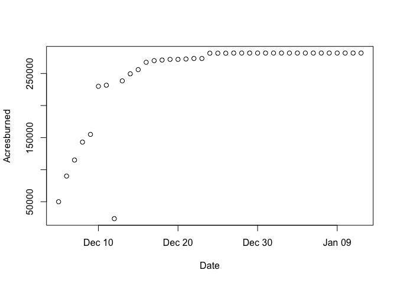

Thomas Fire Data
================
Ysabelle Chavez
10/23/2020

``` r
#install.packages("readxl")
library(readxl)
Thomas_Fire_Progression <- read_excel("~/Desktop/GitHub/144l_students/Input_Data/week1/Thomas_Fire_Progression.xlsx")
View(Thomas_Fire_Progression)

Date <- Thomas_Fire_Progression$Date
Acresburned <- Thomas_Fire_Progression$Acres_Burned
plot(Date,Acresburned)
```

<!-- -->
The plot is showing the amount of Acres Burned between December 2017 to
January 2018 during the Thomas Fire. One can see a steep increase in the
amount of land devastated by the Thomas Fire over a short period of
time.
