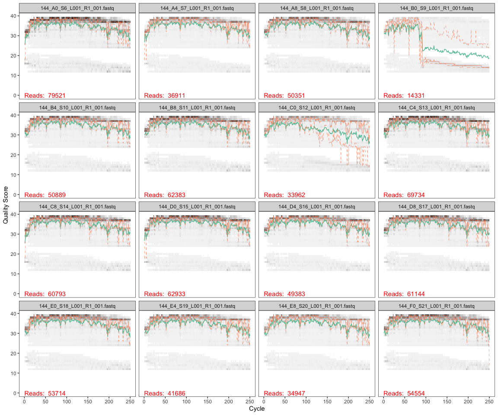
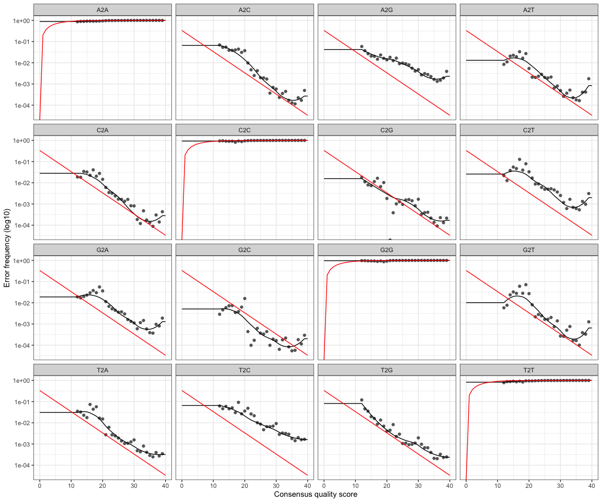
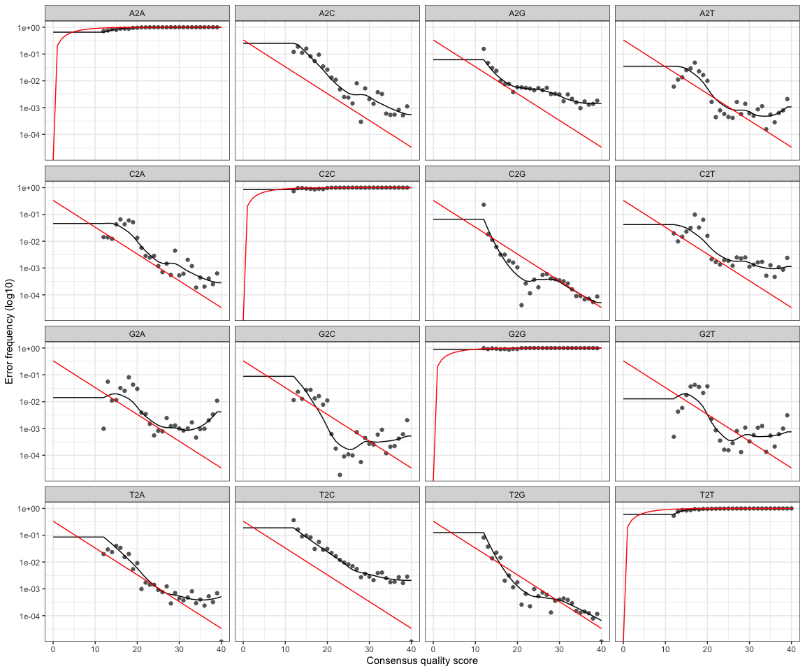

W5 DADA2
================
Ysabelle Chavez
11/11/2020

This script processes trimmed (w/o primers) sequences through the [DADA2
pipline (v 1.16)](https://benjjneb.github.io/dada2/tutorial.html), which
can be installed following these
[steps](https://benjjneb.github.io/dada2/dada-installation.html)

# Install and Load DADA2 and ShortRead from Bioconductor

``` r
# if (!requireNamespace("BiocManager", quietly = TRUE))
#     install.packages("BiocManager")
# BiocManager::install("dada2", version = "3.11")
# BiocManager::install("ShortRead")
# install.packages("tidyverse")
```

``` r
library(tidyverse)
```

    ## ── Attaching packages ─────────────────────────────────────── tidyverse 1.3.0 ──

    ## ✓ ggplot2 3.3.2     ✓ purrr   0.3.4
    ## ✓ tibble  3.0.4     ✓ dplyr   1.0.2
    ## ✓ tidyr   1.1.2     ✓ stringr 1.4.0
    ## ✓ readr   1.4.0     ✓ forcats 0.5.0

    ## ── Conflicts ────────────────────────────────────────── tidyverse_conflicts() ──
    ## x dplyr::filter() masks stats::filter()
    ## x dplyr::lag()    masks stats::lag()

``` r
library(dada2)
```

    ## Loading required package: Rcpp

``` r
library(ShortRead)
```

    ## Loading required package: BiocGenerics

    ## Loading required package: parallel

    ## 
    ## Attaching package: 'BiocGenerics'

    ## The following objects are masked from 'package:parallel':
    ## 
    ##     clusterApply, clusterApplyLB, clusterCall, clusterEvalQ,
    ##     clusterExport, clusterMap, parApply, parCapply, parLapply,
    ##     parLapplyLB, parRapply, parSapply, parSapplyLB

    ## The following objects are masked from 'package:dplyr':
    ## 
    ##     combine, intersect, setdiff, union

    ## The following objects are masked from 'package:stats':
    ## 
    ##     IQR, mad, sd, var, xtabs

    ## The following objects are masked from 'package:base':
    ## 
    ##     anyDuplicated, append, as.data.frame, basename, cbind, colnames,
    ##     dirname, do.call, duplicated, eval, evalq, Filter, Find, get, grep,
    ##     grepl, intersect, is.unsorted, lapply, Map, mapply, match, mget,
    ##     order, paste, pmax, pmax.int, pmin, pmin.int, Position, rank,
    ##     rbind, Reduce, rownames, sapply, setdiff, sort, table, tapply,
    ##     union, unique, unsplit, which, which.max, which.min

    ## Loading required package: BiocParallel

    ## Loading required package: Biostrings

    ## Loading required package: S4Vectors

    ## Loading required package: stats4

    ## 
    ## Attaching package: 'S4Vectors'

    ## The following objects are masked from 'package:dplyr':
    ## 
    ##     first, rename

    ## The following object is masked from 'package:tidyr':
    ## 
    ##     expand

    ## The following object is masked from 'package:base':
    ## 
    ##     expand.grid

    ## Loading required package: IRanges

    ## 
    ## Attaching package: 'IRanges'

    ## The following objects are masked from 'package:dplyr':
    ## 
    ##     collapse, desc, slice

    ## The following object is masked from 'package:purrr':
    ## 
    ##     reduce

    ## Loading required package: XVector

    ## 
    ## Attaching package: 'XVector'

    ## The following object is masked from 'package:purrr':
    ## 
    ##     compact

    ## 
    ## Attaching package: 'Biostrings'

    ## The following object is masked from 'package:base':
    ## 
    ##     strsplit

    ## Loading required package: Rsamtools

    ## Loading required package: GenomeInfoDb

    ## Loading required package: GenomicRanges

    ## Loading required package: GenomicAlignments

    ## Loading required package: SummarizedExperiment

    ## Loading required package: Biobase

    ## Welcome to Bioconductor
    ## 
    ##     Vignettes contain introductory material; view with
    ##     'browseVignettes()'. To cite Bioconductor, see
    ##     'citation("Biobase")', and for packages 'citation("pkgname")'.

    ## Loading required package: DelayedArray

    ## Loading required package: matrixStats

    ## 
    ## Attaching package: 'matrixStats'

    ## The following objects are masked from 'package:Biobase':
    ## 
    ##     anyMissing, rowMedians

    ## The following object is masked from 'package:dplyr':
    ## 
    ##     count

    ## 
    ## Attaching package: 'DelayedArray'

    ## The following objects are masked from 'package:matrixStats':
    ## 
    ##     colMaxs, colMins, colRanges, rowMaxs, rowMins, rowRanges

    ## The following object is masked from 'package:purrr':
    ## 
    ##     simplify

    ## The following objects are masked from 'package:base':
    ## 
    ##     aperm, apply, rowsum

    ## 
    ## Attaching package: 'GenomicAlignments'

    ## The following object is masked from 'package:dplyr':
    ## 
    ##     last

    ## 
    ## Attaching package: 'ShortRead'

    ## The following object is masked from 'package:dplyr':
    ## 
    ##     id

    ## The following object is masked from 'package:purrr':
    ## 
    ##     compose

    ## The following object is masked from 'package:tibble':
    ## 
    ##     view

# Import file names

``` r
path <- "~/Desktop/GitHub/144l_students/Input_Data/week5/EEMB144L_2018_fastq"

#store the names of the forward and rev files as lists
fnFs <- list.files(path, pattern = "_R1_001.fastq", full.names = TRUE)
fnRs <- list.files(path, pattern = "_R2_001.fastq", full.names = TRUE)
```

# Retrieve orientation of primers

The primers targeted the V4 region and are known 514F-Y and 806RB
primers (see Apprill et al.,
2015)\[<http://www.int-res.com/articles/ame_oa/a075p129.pdf>\]

``` r
#store the  forward and reverse primers
FWD = "GTGYCAGCMGCCGCGGTAA"
REV = "GGACTACNVGGGTWTCTAAT"

#now store all the orientations of your forward and reverse  primers
allOrients <- function(primer) {
  # The Biostrings works w/ DNAString objects rather than character vectors
  require(Biostrings)
  dna <- DNAString(primer) 
  orients <- c(Forward = dna, Complement = complement(dna), Reverse = reverse(dna), 
               RevComp = reverseComplement(dna))
  # Convert back to character vector
  return(sapply(orients, toString))  
}

#store the fwd and reverse orientations separately
FWD.orients <- allOrients(FWD)
REV.orients <- allOrients(REV)

#view the orientations of the primers
FWD.orients
```

    ##               Forward            Complement               Reverse 
    ## "GTGYCAGCMGCCGCGGTAA" "CACRGTCGKCGGCGCCATT" "AATGGCGCCGMCGACYGTG" 
    ##               RevComp 
    ## "TTACCGCGGCKGCTGRCAC"

``` r
REV.orients
```

    ##                Forward             Complement                Reverse 
    ## "GGACTACNVGGGTWTCTAAT" "CCTGATGNBCCCAWAGATTA" "TAATCTWTGGGVNCATCAGG" 
    ##                RevComp 
    ## "ATTAGAWACCCBNGTAGTCC"

# search for Primers

``` r
primerHits <- function(primer, fn) {
  # Counts number of reads in which the primer is found
  nhits <- vcountPattern(primer, sread(readFastq(fn)), fixed = FALSE)
  return(sum(nhits > 0))
}
rbind(FWD.ForwardReads = sapply(FWD.orients, primerHits, fn = fnFs[[1]]), 
      FWD.ReverseReads = sapply(FWD.orients, primerHits, fn = fnRs[[1]]), 
      REV.ForwardReads = sapply(REV.orients, primerHits, fn = fnFs[[1]]), 
      REV.ReverseReads = sapply(REV.orients, primerHits, fn = fnRs[[1]]))
```

    ##                  Forward Complement Reverse RevComp
    ## FWD.ForwardReads       0          0       0       0
    ## FWD.ReverseReads       0          0       0     283
    ## REV.ForwardReads       0          0       0    1195
    ## REV.ReverseReads       0          0       0       0

At this point a 4X4 table is returned. If all the numbers are 0, then
you don’t have primers in your sequences :) If they have numbers, use
cutadapt to remove the primers, appropriately. If there are only hits of
the reverse complement in the FWD.ReverseReads and the REV.ForwardReads,
that is ok - it indicates that the reads are long enough to get the
primers on the end. We can trim those out with the MergePairs function
later, by adding trimOverhang=T.

# Inspect read quality profiles

You should look at least some of the quality profiles to assess the
quality of the sequencing run.

## Forward reads

``` r
plotQualityProfile(fnFs[1:16])
```

<!-- --> In
gray-scale is a heat map of the frequency of each quality score at each
base position. The mean quality score at each position is shown by the
green line, and the quartiles of the quality score distribution by the
orange lines.

The DADA2 Tutorial advises trimming the last few nucleotides to avoid
less well-controlled errors that can arise there. These quality profiles
do not suggest that any additional trimming is needed. We will truncate
the forward reads at position 240 (trimming the last 10 nucleotides).

## Reverse reads

``` r
plotQualityProfile(fnRs[1:16])
```

<!-- -->

Typically, the reverse reads will often be poorer quality than the
forward reads, particular at the ends. Use this information to decide
where to uniformly trim your reads. If you have low quality scores
throughout the reads, then you may want to resequence your samples

The reverse reads are of worse quality, especially at the end, which is
common in Illumina sequencing. This isn’t too worrisome, as DADA2
incorporates quality information into its error model which makes the
algorithm robust to lower quality sequence, but trimming as the average
qualities crash will improve the algorithm’s sensitivity to rare
sequence variants. Based on these profiles, we will truncate the reverse
reads at position 150 where the quality distribution crashes.

# Filtering and Trimming

``` r
#Get the sample names
#define the basename of the FnFs as the first part of each fastQ file name until "_L"
#apply this to all samples
sample.names <- sapply(strsplit(basename(fnFs),"_L"), `[`,1)
sample.names
```

    ##  [1] "144_A0_S6"  "144_A4_S7"  "144_A8_S8"  "144_B0_S9"  "144_B4_S10"
    ##  [6] "144_B8_S11" "144_C0_S12" "144_C4_S13" "144_C8_S14" "144_D0_S15"
    ## [11] "144_D4_S16" "144_D8_S17" "144_E0_S18" "144_E4_S19" "144_E8_S20"
    ## [16] "144_F0_S21" "144_F4_S22" "144_F8_S23" "144_G0_S24" "144_G4_S25"
    ## [21] "144_G8_S26" "144_H0_S27" "144_H4_S28" "144_H8_S29"

``` r
#create a "filtered" folder in the working directory as a place to put all the new filtered fastQ files
filt_path <- file.path(path,"filtered")
#add the appropriate designation string to any new files made that will be put into the "filtered" folder
filtFs <- file.path(filt_path, paste0(sample.names, "_F_filt.fastq"))
filtRs <- file.path(filt_path, paste0(sample.names, "_R_filt.fastq"))
```

Below is the actual filtering step. We’re using standard filtering
parameters. 1. dada2 generally advises trimming last few nucleotides for
weird sequencing errors that can pop up there. 2. maxEE is the max
number of expected errors (calc’ed from Q’s) to allow in each read. This
is a probability calculation. 3. minQ is a threshold Q - and read with a
Q \< minQ after truncating reads gets discarded. This isn’t that
important for 16/18S

``` r
out <- filterAndTrim(fnFs, filtFs, fnRs, filtRs, truncLen = c(240,150),  maxN = 0, maxEE = c(2,2), truncQ = 2, rm.phix = TRUE, compress = TRUE) 
#look at the output. this tells you how many reads were removed. 
out
```

    ##                              reads.in reads.out
    ## 144_A0_S6_L001_R1_001.fastq     79521     67972
    ## 144_A4_S7_L001_R1_001.fastq     36911     32141
    ## 144_A8_S8_L001_R1_001.fastq     50351     43213
    ## 144_B0_S9_L001_R1_001.fastq     14331      3070
    ## 144_B4_S10_L001_R1_001.fastq    50889     43678
    ## 144_B8_S11_L001_R1_001.fastq    62383     53847
    ## 144_C0_S12_L001_R1_001.fastq    33962     24060
    ## 144_C4_S13_L001_R1_001.fastq    69734     60423
    ## 144_C8_S14_L001_R1_001.fastq    60793     52969
    ## 144_D0_S15_L001_R1_001.fastq    62933     56012
    ## 144_D4_S16_L001_R1_001.fastq    49383     43001
    ## 144_D8_S17_L001_R1_001.fastq    61144     52929
    ## 144_E0_S18_L001_R1_001.fastq    53714     47453
    ## 144_E4_S19_L001_R1_001.fastq    41686     35888
    ## 144_E8_S20_L001_R1_001.fastq    34947     29277
    ## 144_F0_S21_L001_R1_001.fastq    54554     48269
    ## 144_F4_S22_L001_R1_001.fastq    32800     28766
    ## 144_F8_S23_L001_R1_001.fastq    33312     30014
    ## 144_G0_S24_L001_R1_001.fastq    40935     36168
    ## 144_G4_S25_L001_R1_001.fastq    40109     35236
    ## 144_G8_S26_L001_R1_001.fastq    35610     31788
    ## 144_H0_S27_L001_R1_001.fastq    63711     57388
    ## 144_H4_S28_L001_R1_001.fastq    27892     24291
    ## 144_H8_S29_L001_R1_001.fastq    36860     32338

# Learn the error rates

``` r
errF <- learnErrors(filtFs, multithread = TRUE)
```

    ## 104972400 total bases in 437385 reads from 10 samples will be used for learning the error rates.

``` r
errR <- learnErrors(filtRs, multithread = TRUE)
```

    ## 104130300 total bases in 694202 reads from 16 samples will be used for learning the error rates.

This took \~40s to run on a 2020 Macbook Pro

The dada2 algorithm makes use of a parametric error model (err) as every
amplicon dataset has a different set of error rates. This is what dada2
is all about. This step creates the parameters for designating unique
sequences.

Each sequence has an x number of reads. dada2 uses the numbers of reads
per sequence as well as the q-score to build this model. This algorithm
assumes that your most abundant sequence is real. There is a very high
probability that it is.

What the algorithim does that looks at each base pair of an individul
sequence and calculates the probabilty that the base pair is an error
based on the quality score of the read and the sequence of your most
abundant read. It also does this for the second most abundant sequence,
etc etc. hence the message “convergence after x rounds” after running
the algorithm.





The error rates for each possible transition (A→C, A→G, …) are shown.
Points are the observed error rates for each consensus quality score.
The black line shows the estimated error rates after convergence of the
machine-learning algorithm. The red line shows the error rates expected
under the nominal definition of the Q-score. Here the estimated error
rates (black line) are a good fit to the observed rates (points), and
the error rates drop with increased quality as expected. Everything
looks reasonable and we proceed with confidence.

# Dereplication

This is another big thing that dada2 does. It combines all identical
sequences into one unique sequence, keeping track of the number of
identical sequences.

``` r
derepFs <- derepFastq(filtFs, verbose = TRUE)
```

    ## Dereplicating sequence entries in Fastq file: ~/Desktop/GitHub/144l_students/Input_Data/week5/EEMB144L_2018_fastq/filtered/144_A0_S6_F_filt.fastq

    ## Encountered 18932 unique sequences from 67972 total sequences read.

    ## Dereplicating sequence entries in Fastq file: ~/Desktop/GitHub/144l_students/Input_Data/week5/EEMB144L_2018_fastq/filtered/144_A4_S7_F_filt.fastq

    ## Encountered 9208 unique sequences from 32141 total sequences read.

    ## Dereplicating sequence entries in Fastq file: ~/Desktop/GitHub/144l_students/Input_Data/week5/EEMB144L_2018_fastq/filtered/144_A8_S8_F_filt.fastq

    ## Encountered 12497 unique sequences from 43213 total sequences read.

    ## Dereplicating sequence entries in Fastq file: ~/Desktop/GitHub/144l_students/Input_Data/week5/EEMB144L_2018_fastq/filtered/144_B0_S9_F_filt.fastq

    ## Encountered 1382 unique sequences from 3070 total sequences read.

    ## Dereplicating sequence entries in Fastq file: ~/Desktop/GitHub/144l_students/Input_Data/week5/EEMB144L_2018_fastq/filtered/144_B4_S10_F_filt.fastq

    ## Encountered 11805 unique sequences from 43678 total sequences read.

    ## Dereplicating sequence entries in Fastq file: ~/Desktop/GitHub/144l_students/Input_Data/week5/EEMB144L_2018_fastq/filtered/144_B8_S11_F_filt.fastq

    ## Encountered 14833 unique sequences from 53847 total sequences read.

    ## Dereplicating sequence entries in Fastq file: ~/Desktop/GitHub/144l_students/Input_Data/week5/EEMB144L_2018_fastq/filtered/144_C0_S12_F_filt.fastq

    ## Encountered 7856 unique sequences from 24060 total sequences read.

    ## Dereplicating sequence entries in Fastq file: ~/Desktop/GitHub/144l_students/Input_Data/week5/EEMB144L_2018_fastq/filtered/144_C4_S13_F_filt.fastq

    ## Encountered 13719 unique sequences from 60423 total sequences read.

    ## Dereplicating sequence entries in Fastq file: ~/Desktop/GitHub/144l_students/Input_Data/week5/EEMB144L_2018_fastq/filtered/144_C8_S14_F_filt.fastq

    ## Encountered 14168 unique sequences from 52969 total sequences read.

    ## Dereplicating sequence entries in Fastq file: ~/Desktop/GitHub/144l_students/Input_Data/week5/EEMB144L_2018_fastq/filtered/144_D0_S15_F_filt.fastq

    ## Encountered 15521 unique sequences from 56012 total sequences read.

    ## Dereplicating sequence entries in Fastq file: ~/Desktop/GitHub/144l_students/Input_Data/week5/EEMB144L_2018_fastq/filtered/144_D4_S16_F_filt.fastq

    ## Encountered 9469 unique sequences from 43001 total sequences read.

    ## Dereplicating sequence entries in Fastq file: ~/Desktop/GitHub/144l_students/Input_Data/week5/EEMB144L_2018_fastq/filtered/144_D8_S17_F_filt.fastq

    ## Encountered 14768 unique sequences from 52929 total sequences read.

    ## Dereplicating sequence entries in Fastq file: ~/Desktop/GitHub/144l_students/Input_Data/week5/EEMB144L_2018_fastq/filtered/144_E0_S18_F_filt.fastq

    ## Encountered 13712 unique sequences from 47453 total sequences read.

    ## Dereplicating sequence entries in Fastq file: ~/Desktop/GitHub/144l_students/Input_Data/week5/EEMB144L_2018_fastq/filtered/144_E4_S19_F_filt.fastq

    ## Encountered 9521 unique sequences from 35888 total sequences read.

    ## Dereplicating sequence entries in Fastq file: ~/Desktop/GitHub/144l_students/Input_Data/week5/EEMB144L_2018_fastq/filtered/144_E8_S20_F_filt.fastq

    ## Encountered 8628 unique sequences from 29277 total sequences read.

    ## Dereplicating sequence entries in Fastq file: ~/Desktop/GitHub/144l_students/Input_Data/week5/EEMB144L_2018_fastq/filtered/144_F0_S21_F_filt.fastq

    ## Encountered 14157 unique sequences from 48269 total sequences read.

    ## Dereplicating sequence entries in Fastq file: ~/Desktop/GitHub/144l_students/Input_Data/week5/EEMB144L_2018_fastq/filtered/144_F4_S22_F_filt.fastq

    ## Encountered 8088 unique sequences from 28766 total sequences read.

    ## Dereplicating sequence entries in Fastq file: ~/Desktop/GitHub/144l_students/Input_Data/week5/EEMB144L_2018_fastq/filtered/144_F8_S23_F_filt.fastq

    ## Encountered 8155 unique sequences from 30014 total sequences read.

    ## Dereplicating sequence entries in Fastq file: ~/Desktop/GitHub/144l_students/Input_Data/week5/EEMB144L_2018_fastq/filtered/144_G0_S24_F_filt.fastq

    ## Encountered 10822 unique sequences from 36168 total sequences read.

    ## Dereplicating sequence entries in Fastq file: ~/Desktop/GitHub/144l_students/Input_Data/week5/EEMB144L_2018_fastq/filtered/144_G4_S25_F_filt.fastq

    ## Encountered 8483 unique sequences from 35236 total sequences read.

    ## Dereplicating sequence entries in Fastq file: ~/Desktop/GitHub/144l_students/Input_Data/week5/EEMB144L_2018_fastq/filtered/144_G8_S26_F_filt.fastq

    ## Encountered 8503 unique sequences from 31788 total sequences read.

    ## Dereplicating sequence entries in Fastq file: ~/Desktop/GitHub/144l_students/Input_Data/week5/EEMB144L_2018_fastq/filtered/144_H0_S27_F_filt.fastq

    ## Encountered 15044 unique sequences from 57388 total sequences read.

    ## Dereplicating sequence entries in Fastq file: ~/Desktop/GitHub/144l_students/Input_Data/week5/EEMB144L_2018_fastq/filtered/144_H4_S28_F_filt.fastq

    ## Encountered 5919 unique sequences from 24291 total sequences read.

    ## Dereplicating sequence entries in Fastq file: ~/Desktop/GitHub/144l_students/Input_Data/week5/EEMB144L_2018_fastq/filtered/144_H8_S29_F_filt.fastq

    ## Encountered 9702 unique sequences from 32338 total sequences read.

``` r
derepRs <- derepFastq(filtRs, verbose = TRUE)
```

    ## Dereplicating sequence entries in Fastq file: ~/Desktop/GitHub/144l_students/Input_Data/week5/EEMB144L_2018_fastq/filtered/144_A0_S6_R_filt.fastq

    ## Encountered 22356 unique sequences from 67972 total sequences read.

    ## Dereplicating sequence entries in Fastq file: ~/Desktop/GitHub/144l_students/Input_Data/week5/EEMB144L_2018_fastq/filtered/144_A4_S7_R_filt.fastq

    ## Encountered 10600 unique sequences from 32141 total sequences read.

    ## Dereplicating sequence entries in Fastq file: ~/Desktop/GitHub/144l_students/Input_Data/week5/EEMB144L_2018_fastq/filtered/144_A8_S8_R_filt.fastq

    ## Encountered 15296 unique sequences from 43213 total sequences read.

    ## Dereplicating sequence entries in Fastq file: ~/Desktop/GitHub/144l_students/Input_Data/week5/EEMB144L_2018_fastq/filtered/144_B0_S9_R_filt.fastq

    ## Encountered 1593 unique sequences from 3070 total sequences read.

    ## Dereplicating sequence entries in Fastq file: ~/Desktop/GitHub/144l_students/Input_Data/week5/EEMB144L_2018_fastq/filtered/144_B4_S10_R_filt.fastq

    ## Encountered 14378 unique sequences from 43678 total sequences read.

    ## Dereplicating sequence entries in Fastq file: ~/Desktop/GitHub/144l_students/Input_Data/week5/EEMB144L_2018_fastq/filtered/144_B8_S11_R_filt.fastq

    ## Encountered 19110 unique sequences from 53847 total sequences read.

    ## Dereplicating sequence entries in Fastq file: ~/Desktop/GitHub/144l_students/Input_Data/week5/EEMB144L_2018_fastq/filtered/144_C0_S12_R_filt.fastq

    ## Encountered 11295 unique sequences from 24060 total sequences read.

    ## Dereplicating sequence entries in Fastq file: ~/Desktop/GitHub/144l_students/Input_Data/week5/EEMB144L_2018_fastq/filtered/144_C4_S13_R_filt.fastq

    ## Encountered 17845 unique sequences from 60423 total sequences read.

    ## Dereplicating sequence entries in Fastq file: ~/Desktop/GitHub/144l_students/Input_Data/week5/EEMB144L_2018_fastq/filtered/144_C8_S14_R_filt.fastq

    ## Encountered 17700 unique sequences from 52969 total sequences read.

    ## Dereplicating sequence entries in Fastq file: ~/Desktop/GitHub/144l_students/Input_Data/week5/EEMB144L_2018_fastq/filtered/144_D0_S15_R_filt.fastq

    ## Encountered 19854 unique sequences from 56012 total sequences read.

    ## Dereplicating sequence entries in Fastq file: ~/Desktop/GitHub/144l_students/Input_Data/week5/EEMB144L_2018_fastq/filtered/144_D4_S16_R_filt.fastq

    ## Encountered 13776 unique sequences from 43001 total sequences read.

    ## Dereplicating sequence entries in Fastq file: ~/Desktop/GitHub/144l_students/Input_Data/week5/EEMB144L_2018_fastq/filtered/144_D8_S17_R_filt.fastq

    ## Encountered 19687 unique sequences from 52929 total sequences read.

    ## Dereplicating sequence entries in Fastq file: ~/Desktop/GitHub/144l_students/Input_Data/week5/EEMB144L_2018_fastq/filtered/144_E0_S18_R_filt.fastq

    ## Encountered 17696 unique sequences from 47453 total sequences read.

    ## Dereplicating sequence entries in Fastq file: ~/Desktop/GitHub/144l_students/Input_Data/week5/EEMB144L_2018_fastq/filtered/144_E4_S19_R_filt.fastq

    ## Encountered 13559 unique sequences from 35888 total sequences read.

    ## Dereplicating sequence entries in Fastq file: ~/Desktop/GitHub/144l_students/Input_Data/week5/EEMB144L_2018_fastq/filtered/144_E8_S20_R_filt.fastq

    ## Encountered 14855 unique sequences from 29277 total sequences read.

    ## Dereplicating sequence entries in Fastq file: ~/Desktop/GitHub/144l_students/Input_Data/week5/EEMB144L_2018_fastq/filtered/144_F0_S21_R_filt.fastq

    ## Encountered 18646 unique sequences from 48269 total sequences read.

    ## Dereplicating sequence entries in Fastq file: ~/Desktop/GitHub/144l_students/Input_Data/week5/EEMB144L_2018_fastq/filtered/144_F4_S22_R_filt.fastq

    ## Encountered 9704 unique sequences from 28766 total sequences read.

    ## Dereplicating sequence entries in Fastq file: ~/Desktop/GitHub/144l_students/Input_Data/week5/EEMB144L_2018_fastq/filtered/144_F8_S23_R_filt.fastq

    ## Encountered 9645 unique sequences from 30014 total sequences read.

    ## Dereplicating sequence entries in Fastq file: ~/Desktop/GitHub/144l_students/Input_Data/week5/EEMB144L_2018_fastq/filtered/144_G0_S24_R_filt.fastq

    ## Encountered 13092 unique sequences from 36168 total sequences read.

    ## Dereplicating sequence entries in Fastq file: ~/Desktop/GitHub/144l_students/Input_Data/week5/EEMB144L_2018_fastq/filtered/144_G4_S25_R_filt.fastq

    ## Encountered 11615 unique sequences from 35236 total sequences read.

    ## Dereplicating sequence entries in Fastq file: ~/Desktop/GitHub/144l_students/Input_Data/week5/EEMB144L_2018_fastq/filtered/144_G8_S26_R_filt.fastq

    ## Encountered 10202 unique sequences from 31788 total sequences read.

    ## Dereplicating sequence entries in Fastq file: ~/Desktop/GitHub/144l_students/Input_Data/week5/EEMB144L_2018_fastq/filtered/144_H0_S27_R_filt.fastq

    ## Encountered 19510 unique sequences from 57388 total sequences read.

    ## Dereplicating sequence entries in Fastq file: ~/Desktop/GitHub/144l_students/Input_Data/week5/EEMB144L_2018_fastq/filtered/144_H4_S28_R_filt.fastq

    ## Encountered 9788 unique sequences from 24291 total sequences read.

    ## Dereplicating sequence entries in Fastq file: ~/Desktop/GitHub/144l_students/Input_Data/week5/EEMB144L_2018_fastq/filtered/144_H8_S29_R_filt.fastq

    ## Encountered 11301 unique sequences from 32338 total sequences read.

``` r
# Name the derep-class objects by the sample names
names(derepFs) <- sample.names
names(derepRs) <- sample.names
```

This took \~5s on a 2020 Macbook Pro

# Infer the sequence variants

Apply the core dada2 sample inference algorithm to the dereplicated
data.

Infer the sequence variants in each sample, taking out the sequence
variants that have excessive error rates.

So here, we are applying the error models to the data. Before, the error
models were run using a subset of the data (parameterizing). Now, we’re
using the parameters of the model and applying it to the whole data set
to see which sequences are real and which are not.

``` r
dadaFs <- dada(derepFs, err = errF, multithread = TRUE)
```

    ## Sample 1 - 67972 reads in 18932 unique sequences.
    ## Sample 2 - 32141 reads in 9208 unique sequences.
    ## Sample 3 - 43213 reads in 12497 unique sequences.
    ## Sample 4 - 3070 reads in 1382 unique sequences.
    ## Sample 5 - 43678 reads in 11805 unique sequences.
    ## Sample 6 - 53847 reads in 14833 unique sequences.
    ## Sample 7 - 24060 reads in 7856 unique sequences.
    ## Sample 8 - 60423 reads in 13719 unique sequences.
    ## Sample 9 - 52969 reads in 14168 unique sequences.
    ## Sample 10 - 56012 reads in 15521 unique sequences.
    ## Sample 11 - 43001 reads in 9469 unique sequences.
    ## Sample 12 - 52929 reads in 14768 unique sequences.
    ## Sample 13 - 47453 reads in 13712 unique sequences.
    ## Sample 14 - 35888 reads in 9521 unique sequences.
    ## Sample 15 - 29277 reads in 8628 unique sequences.
    ## Sample 16 - 48269 reads in 14157 unique sequences.
    ## Sample 17 - 28766 reads in 8088 unique sequences.
    ## Sample 18 - 30014 reads in 8155 unique sequences.
    ## Sample 19 - 36168 reads in 10822 unique sequences.
    ## Sample 20 - 35236 reads in 8483 unique sequences.
    ## Sample 21 - 31788 reads in 8503 unique sequences.
    ## Sample 22 - 57388 reads in 15044 unique sequences.
    ## Sample 23 - 24291 reads in 5919 unique sequences.
    ## Sample 24 - 32338 reads in 9702 unique sequences.

``` r
dadaRs <- dada(derepRs, err = errR, multithread = TRUE)
```

    ## Sample 1 - 67972 reads in 22356 unique sequences.
    ## Sample 2 - 32141 reads in 10600 unique sequences.
    ## Sample 3 - 43213 reads in 15296 unique sequences.
    ## Sample 4 - 3070 reads in 1593 unique sequences.
    ## Sample 5 - 43678 reads in 14378 unique sequences.
    ## Sample 6 - 53847 reads in 19110 unique sequences.
    ## Sample 7 - 24060 reads in 11295 unique sequences.
    ## Sample 8 - 60423 reads in 17845 unique sequences.
    ## Sample 9 - 52969 reads in 17700 unique sequences.
    ## Sample 10 - 56012 reads in 19854 unique sequences.
    ## Sample 11 - 43001 reads in 13776 unique sequences.
    ## Sample 12 - 52929 reads in 19687 unique sequences.
    ## Sample 13 - 47453 reads in 17696 unique sequences.
    ## Sample 14 - 35888 reads in 13559 unique sequences.
    ## Sample 15 - 29277 reads in 14855 unique sequences.
    ## Sample 16 - 48269 reads in 18646 unique sequences.
    ## Sample 17 - 28766 reads in 9704 unique sequences.
    ## Sample 18 - 30014 reads in 9645 unique sequences.
    ## Sample 19 - 36168 reads in 13092 unique sequences.
    ## Sample 20 - 35236 reads in 11615 unique sequences.
    ## Sample 21 - 31788 reads in 10202 unique sequences.
    ## Sample 22 - 57388 reads in 19510 unique sequences.
    ## Sample 23 - 24291 reads in 9788 unique sequences.
    ## Sample 24 - 32338 reads in 11301 unique sequences.

This took \~7s on a Macbook Pro

merge the overlapping reads -\> this will also decrease the number of
sequence variants. If you above you had hits of the reverse complement
in the FWD.ReverseReads and the REV.ForwardReads, you can trim them here
by adding trimOverhang = T.

``` r
mergers <- mergePairs(dadaFs, derepFs, dadaRs, derepRs, verbose = TRUE, trimOverhang = T)
```

    ## 57725 paired-reads (in 283 unique pairings) successfully merged out of 67213 (in 803 pairings) input.

    ## 28832 paired-reads (in 153 unique pairings) successfully merged out of 31610 (in 412 pairings) input.

    ## 37442 paired-reads (in 192 unique pairings) successfully merged out of 42526 (in 521 pairings) input.

    ## 2394 paired-reads (in 65 unique pairings) successfully merged out of 2851 (in 152 pairings) input.

    ## 38302 paired-reads (in 165 unique pairings) successfully merged out of 42994 (in 464 pairings) input.

    ## 46571 paired-reads (in 214 unique pairings) successfully merged out of 53253 (in 614 pairings) input.

    ## 20492 paired-reads (in 184 unique pairings) successfully merged out of 23589 (in 454 pairings) input.

    ## 56568 paired-reads (in 153 unique pairings) successfully merged out of 59785 (in 445 pairings) input.

    ## 50139 paired-reads (in 211 unique pairings) successfully merged out of 52469 (in 516 pairings) input.

    ## 48577 paired-reads (in 263 unique pairings) successfully merged out of 55347 (in 637 pairings) input.

    ## 41080 paired-reads (in 118 unique pairings) successfully merged out of 42574 (in 311 pairings) input.

    ## 49836 paired-reads (in 210 unique pairings) successfully merged out of 52449 (in 511 pairings) input.

    ## 41193 paired-reads (in 227 unique pairings) successfully merged out of 46790 (in 555 pairings) input.

    ## 33136 paired-reads (in 149 unique pairings) successfully merged out of 35471 (in 369 pairings) input.

    ## 26263 paired-reads (in 146 unique pairings) successfully merged out of 28702 (in 477 pairings) input.

    ## 38870 paired-reads (in 215 unique pairings) successfully merged out of 47485 (in 605 pairings) input.

    ## 26000 paired-reads (in 125 unique pairings) successfully merged out of 28458 (in 272 pairings) input.

    ## 27284 paired-reads (in 171 unique pairings) successfully merged out of 29636 (in 335 pairings) input.

    ## 29960 paired-reads (in 191 unique pairings) successfully merged out of 35569 (in 402 pairings) input.

    ## 32815 paired-reads (in 126 unique pairings) successfully merged out of 34805 (in 339 pairings) input.

    ## 28824 paired-reads (in 141 unique pairings) successfully merged out of 31390 (in 297 pairings) input.

    ## 40607 paired-reads (in 243 unique pairings) successfully merged out of 56564 (in 596 pairings) input.

    ## 22824 paired-reads (in 109 unique pairings) successfully merged out of 23936 (in 268 pairings) input.

    ## 28250 paired-reads (in 148 unique pairings) successfully merged out of 31963 (in 304 pairings) input.

inspect the merged data frame from the first sample. this will output a
table. the numbers in the forward and reverse columns tell where those
sequences are in the dadaFs and dadaRs files. nmatch is how many bases
matched. we uniformly trimmed the amplicons so they should all be the
same.

``` r
head(mergers[[1]])
```

    ##                                                                                                                                                                                                                                                        sequence
    ## 1 TACGGAGGGTGCAAGCGTTACTCGGAATCACTGGGCGTAAAGAGCGTGTAGGCGGATAGTTAAGTTTGAAGTGAAATCCTATGGCTCAACCATAGAACTGCTTTGAAAACTGATTATCTAGAATATGGGAGAGGTAGATGGAATTTCTGGTGTAGGGGTAAAATCCGTAGAGATCAGAAGGAATACCGATTGCGAAGGCGATCTACTGGAACATTATTGACGCTGAGACGCGAAAGCGTGGGGAGCAAACAGG
    ## 2 TACGGAGGGTCCGAGCGTTAATCGGAATTACTGGGCGTAAAGCGCGCGTAGGTGGTTTTGTCAGTCAGATGTGAAAGCCCAGGGCTCAACCTTGGAACTGCACCTGATACTGCAAGACTAGAGTACAATAGAGGGGAGTGGAATTTCCGGTGTAGCGGTGAAATGCGTAGAGATCGGAAGGAACACCAGTGGCGAAGGCGACTCCCTGGATTGATACTGACACTGAGGTGCGAAAGCGTGGGGAGCAAACAGG
    ## 3 TACGAAGGGACCTAGCGTAGTTCGGAATTACTGGGCTTAAAGAGTTCGTAGGTGGTTGAAAAAGTTAGTGGTGAAATCCCAGAGCTTAACTCTGGAACTGCCATTAAAACTTTTCAGCTAGAGTATGATAGAGGAAAGCAGAATTTCTAGTGTAGAGGTGAAATTCGTAGATATTAGAAAGAATACCAATTGCGAAGGCAGCTTTCTGGATCATTACTGACACTGAGGAACGAAAGCATGGGTAGCGAAGAGG
    ## 4 TACGGAAGGTGCAAGCGTTAATCGGAATTACTGGGCGTAAAGCGCGCGTAGGTGGTTTGTTAAGTTGGATGTGAAAGCCCTGGGCTCAACCTAGGAACTGCATCCAAAACTAACTCACTAGAGTACGATAGAGGGAGGTAGAATTCATAGTGTAGCGGTGGAATGCGTAGATATTATGAAGAATACCAGTGGCGAAGGCGGCCTCCTGGATCTGTACTGACACTGAGGTGCGAAAGCGTGGGTAGCGAACAGG
    ## 6 TACGGGAGTGGCAAGCGTTATCCGGAATTATTGGGCGTAAAGCGTCCGCAGGCGGCCCTTCAAGTCTGCTGTTAAAAAGTGGAGCTTAACTCCATCATGGCAGTGGAAACTGAGGGGCTTGAGTGTGGTAGGGGCAGAGGGAATTCCCGGTGTAGCGGTGAAATGCGTAGATATCGGGAAGAACACCAGTGGCGAAGGCGCTCTGCTGGGCCATCACTGACGCTCATGGACGAAAGCCAGGGGAGCGAAAGGG
    ## 7 TACGGAAGGTCCAAGCGTTAATCGGAATTACTGGGCGTAAAGCGCGCGTAGGTGGTTTATTAAGTTGGATGTGAAATCCCCGGGCTCAACCTGGGAACTGCATCCAAAACTGATTCACTAGAGTACGATAGAGGGAGGTAGAATTCACAGTGTAGCGGTGGAATGCGTAGATATTGTGAAGAATACCAATGGCGAAGGCAGCCTCCTGGATCTGTACTGACACTGAGGTGCGAAAGCGTGGGTAGCGAACAGG
    ##   abundance forward reverse nmatch nmismatch nindel prefer accept
    ## 1      3642       2       1    137         0      0      1   TRUE
    ## 2      3613       3       3    137         0      0      1   TRUE
    ## 3      3021       1       2    137         0      0      1   TRUE
    ## 4      3019       4       4    137         0      0      1   TRUE
    ## 6      2251       5       6    137         0      0      1   TRUE
    ## 7      1870       6       9    137         0      0      1   TRUE

save the unassigned merged reads

``` r
saveRDS(mergers, "~/Desktop/GitHub/144l_students/Output_Data/week5/dada_merged.rds")
saveRDS(mergers, "~/Desktop/GitHub/144l_students/Input_Data/week6/dada_merged.rds")
```

construct a sequence table of our samples that is analagous to the “OTU
table” produced by classical methods

``` r
seqtab <- makeSequenceTable(mergers)
dim(seqtab) # samples by unique sequence
```

    ## [1]  24 815

check the distribution of sequence lengths

``` r
table(nchar(getSequences(seqtab))) 
```

    ## 
    ## 252 253 254 255 256 257 258 265 266 270 373 
    ##  21 739  39   2   4   1   3   1   1   3   1

# Remove the Chimeras

in PCR, two or more biological sequences can attach to each other and
then polymerase builds a non-biological sequence. Weird. These are
artefacts that need to be removed.

``` r
seqtab.nochim <- removeBimeraDenovo(seqtab, verbose = TRUE)
```

    ## Identified 47 bimeras out of 815 input sequences.

``` r
dim(seqtab.nochim)
```

    ## [1]  24 768

check the proportion of sequences that are not chimeras

``` r
sum(seqtab.nochim)/sum(seqtab)
```

    ## [1] 0.9951978

# Assign taxonomy using a reference database

here we are referencing the Silva database

``` r
taxa <- assignTaxonomy(seqtab.nochim, "~/Desktop/GitHub/144l_students/Input_Data/week5/Reference_Database/silva_nr_v138_train_set.fa", multithread = TRUE)
```

This took \~90s to complete on a 2020 Macbook Pro

create a table out of the taxa data (one with the sequences and
assigments, one with just all the taxa)

these are the tables you want to save\!\!

``` r
saveRDS(t(seqtab.nochim), "~/Desktop/GitHub/144l_students/Output_Data/week5/seqtab-nochimtaxa.rds")
saveRDS(taxa,"~/Desktop/GitHub/144l_students/Output_Data/week5/taxa.rds")

saveRDS(t(seqtab.nochim), "~/Desktop/GitHub/144l_students/Input_Data/week6/seqtab-nochimtaxa.rds")
saveRDS(taxa,"~/Desktop/GitHub/144l_students/Input_Data/week6/taxa.rds")
```
